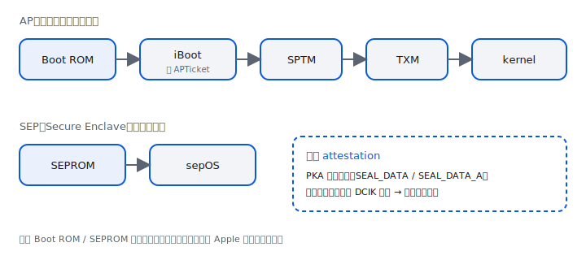
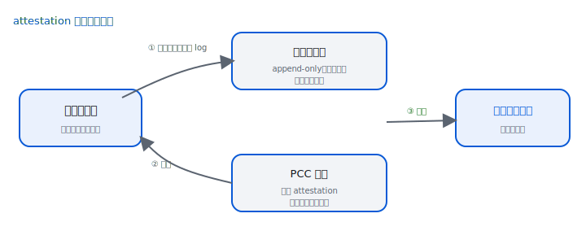
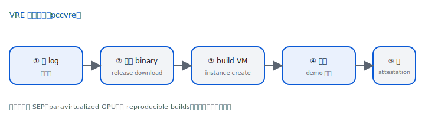
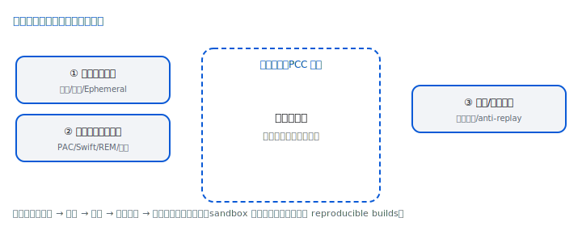
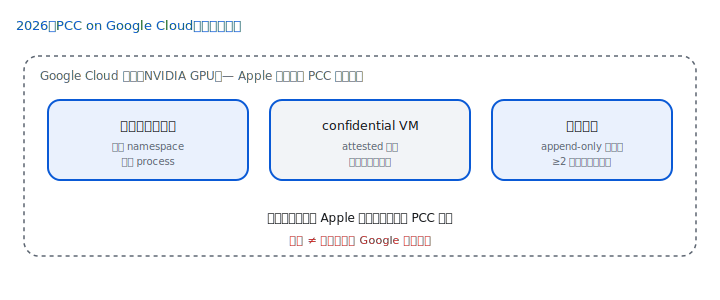

# Private Cloud Compute：可驗證的雲端 AI 隱私（開發者版）

> 技術參考。事實全部引自 `content/knowledge-base.md`，逐句附 `[S0X]`（來源見 `sources/source-index.md`）。
> 全程區分「**Apple 宣稱**」與「**可獨立驗證**」。繁體中文，術語首次附英文。

---

## 0. 摘要與如何閱讀


*圖 D5：五大核心要求一覽。`[S03]`*

> [!SUMMARY] 先講結論
>
> 1. PCC 把「Apple 裝置等級的安全與隱私」帶上雲，並以**技術機制**而非政策承諾強制達成。`[S11]`
> 2. 可驗證鏈的核心是 **attestation ↔ 透明性日誌**：裝置只把資料送給能密碼學證明自己執行公開、可查軟體的節點——但 Apple **未提供 reproducible builds**，「源碼 ↔ binary」無法驗證。`[S05, S07]`
> 3. 五大要求即使在遭攻擊時也被設計為**永不被違反**；但保證針對 PCC 請求，威脅模型有其假設邊界。`[S03, S07]`

Private Cloud Compute（PCC，私有雲端運算）是 Apple 為 Apple Intelligence 中**超出裝置端能力**的請求所打造的雲端推論系統，目標是把「Apple 裝置等級的安全與隱私」帶上雲，並以**技術機制**而非政策承諾來強制達成。`[S11]`

**五大核心要求（各一句）**：`[S03]`
1. **無狀態運算（Stateless computation）**：個資只為當次請求而用，回應後不留存。`[S03]`
2. **可強制執行的保證（Enforceable guarantees）**：保證源自可分析的技術，而非政策。`[S03]`
3. **無特權執行期存取（No privileged runtime access）**：無人（含 Apple 維運）能繞過保護讀資料。`[S03]`
4. **不可被指定目標（Non-targetability）**：無法鎖定特定使用者而不驚動整個系統。`[S03]`
5. **可驗證透明性（Verifiable transparency）**：外部研究者可驗證實際執行的軟體。`[S03]`

**讀者假設**：熟悉公鑰密碼學、TEE／Secure Enclave、attestation、code signing 與威脅建模。

**章節地圖**：§1 動機 →（如何）§2 五要求 → §3 信任根與開機鏈 → §4 請求生命週期 → §5 Attested Request Handling → §6 推論引擎與分散式推論 → §7 可驗證透明性 → §8 VRE 實戰 → §9 管理與維運 → §10 威脅模型 →（代表什麼）§11 Bounty → §12 2026 擴展 → §13 對你系統的啟示 → §14 附錄。

**怎麼讀**：若你只想抓重點，看 §0、§2、§7、§10 的「宣稱 vs 可驗證」框；若你想動手，直接跳 §8。

> [!MISCONCEPTION] 常見誤解（先排除）
>
> - PCC **不等於**「Apple 永遠看不到任何東西」——保證針對**送進 PCC 的請求**，且威脅模型有其假設邊界。`[S07]`
> - **公開源碼 ≠ 可重現 build**：研究者能驗「attestation ↔ 透明性日誌」，但**無法**逐位元組對照源碼與 binary（§7.4）。`[S07]`
> - **2026 延伸到 Google Cloud ≠ 把資料交給 Google 任意處理**：信任鏈仍錨定於 Apple 簽核與裝置端驗證（§12）。`[S13]`

---

## 1. 為何 server AI 需要新模型

雲端 AI 要對使用者請求做有意義的處理，通常需要對個資的**未加密存取**，因此無法直接沿用端到端加密的威脅模型。`[S11]` 傳統雲端安全模型的缺口在於：隱私宣稱**難以驗證、難以強制**——服務方聲稱「不記錄某資料」，研究者通常無從查證，服務方一次改版也可能意外開始記錄。`[S11]`

PCC 的出發點是把 on-device 的優勢（使用者掌控裝置、軟硬體可受檢視、Apple 無特權存取）帶進雲端。`[S11]`


*圖 D1：較簡單的任務由裝置端較小模型處理，超出能力才安全卸載到 PCC。`[S11]`*

> [!BOUNDARY] 宣稱 vs 可驗證
>
> 本章是設計動機（Apple 宣稱）。其「可驗證」與否，取決於後續 §7/§8 的透明性機制是否成立。

對照傳統雲端：每台應用伺服器通常持有整個資料庫的存取憑證，單台被攻陷即足以存取任何使用者資料——PCC 刻意不採此模型。`[S03]` 換句話說，PCC 的設計把「妥協一台＝拿到所有資料」改成「要拿到特定使用者資料，必須大規模攻陷整個機隊」（見 §5 節點選擇與 §10 目標擴散）。

---

## 2. 五大核心要求（深度）

> 以下定義採官方標準措辭。每節：**定義／機制／如何強制／可驗證點**。`[S03]`

### 2.1 個資的無狀態運算
- **定義**：PCC 只為完成當次請求使用個資；個資**永不**提供給使用者以外的任何人，**包含 Apple 員工，即使處理進行中**；回應後不得保留，亦不得透過 logging／debugging 留存。`[S03]`
- **機制**：節點採 **Ephemeral Data Mode（短暫資料模式）**——可變資料寫在與唯讀系統卷（Signed System Volume）分離的專屬 data volume；SEP 在**每次開機隨機化**其儲存金鑰階層，密碼學上保證任一 session 寫入的資料無法被後續開機讀取；`mobile_obliterator` 開機任務丟棄前次加密 data volume 並重建乾淨卷。`[S16]`
- **如何強制 / 可驗證點**：機制在節點軟體內，屬透明性日誌涵蓋範圍，研究者可檢視（見 §7/§8）。未來若允許跨請求快取，仍以裝置提供的金鑰加密、請求後抹除 PCC 自有的金鑰副本來維持無狀態。`[S03]`

### 2.2 可強制執行的保證
- **定義**：保證**完全可由技術強制**時最穩固；所有對整體保證有關鍵貢獻的元件都須可被約束與分析。`[S03]`
- **機制**：故核心保證**不依賴**難以推理的外部元件——官方舉例 TLS-terminating load balancer 在 debug session 可能對資料做什麼極難推理；維運需求（伺服器指標、錯誤日誌）須以不破壞隱私的機制支援（見 §9）。`[S03]`

### 2.3 無特權執行期存取
- **定義**：不得有可讓 Apple 站點可靠性（SRE）人員繞過隱私保證的特權介面，**即使處理重大事故時**；亦不得有任何在執行期**擴大特權範圍**的機制（如載入額外軟體）。`[S03]`
- **機制**：節點移除/停用動態執行碼途徑——系統 shell（如 `zsh`）、直譯器（如 JavaScriptCore）、除錯器（如 `debugserver`）、JIT。`[S16]` 維運所需的健康/診斷資料改由受限、可稽核的專用介面取得（§9）。`[S06]`

### 2.4 不可被指定目標
- **定義**：攻擊者若不對**整個系統**發動廣泛攻擊，就不應能鎖定危害**特定目標使用者**的個資；即使對能在供應鏈做實體攻擊或惡意進入資料中心者亦須成立。`[S03]`
- **機制**：以**密碼學上不可連結（unlinkable）的權杖**施加使用限制（見 §4），並把請求只加密給大小為 k 的小節點集合（見 §5）。`[S04, S23]`

### 2.5 可驗證透明性
- **定義**：研究者須能**高度確信**地驗證保證與公開承諾相符，且能驗證**生產環境實際執行的軟體與其檢查過的為同一份**。`[S03]` 細節見 §7。`[S05]`

> [!BOUNDARY] 宣稱 vs 可驗證
>
> ①②③④⑤ 都是技術主張；其中「實際執行軟體＝公開軟體」這一點，可透過 attestation ↔ 透明性日誌的綁定獨立驗證（§7）。但「源碼 ↔ binary」**無法**驗證（無 reproducible builds，見 §7.4）。`[S07]`

---

## 3. 信任根與開機鏈


*圖 D2：硬體信任根與開機/碼信任鏈。`[S14, S16]`*

### 3.1 Apple silicon 信任根
PCC 的信任根是**自研 Apple silicon 伺服器**，安全特性根植矽晶、製造後不可變（連 Apple 也無法更改）。`[S14]` Apple silicon 三項關鍵不可變特性：`[S14]`
1. **硬體層密碼學身分**：金鑰於製造時產生並熔入矽晶，僅 Secure Enclave Processor（SEP）可用，受硬體保護、不可匯出。`[S14]`
2. **安全且量測式開機（Secure & Measured Boot）**：Secure Boot 量測並驗證所有執行碼；起點 Boot ROM 於製造時置入矽晶、不可變。`[S14]`
3. **硬體式 attestation**：SEP 以硬體身分簽署軟體量測值。`[S14]`

**Secure Enclave（SEP，安全隔離區）**：SoC 上的協同處理器，含真隨機數產生器、Public-Key Accelerator（PKA）、專屬 AES 引擎；製造時將 **Unique ID（UID）** 熔入矽晶，PKA 金鑰與 UID 糾纏綁定，UID 與 PKA 私鑰**永不暴露給任何軟體**。`[S14]` PCC 新增 **Data Center Identity Key（DCIK，資料中心身分金鑰）**：在 SEP 的 PKA 內以固定種子產生，公鑰於製造時記入 Apple 裝置資料庫。`[S14]`

### 3.2 開機鏈
- **AP 端**：Boot ROM → 驗證 **Image4** 開機清單（**APTicket**，經 Trusted Signing Service 簽核）→ 量測 iBoot 並鎖入唯寫一次暫存器 **SEAL_DATA_A** → iBoot 續驗 **SPTM（Secure Page Table Monitor）**、**TXM（Trusted Execution Monitor）**、Kernel Cache → SPTM 啟動記憶體管理並初始化 TXM → kernel → user space（由 Code Signing 延伸 Secure Boot）。`[S16]`
- **SEP 端**：SEPROM（不可變）→ 驗證並執行 sepOS，鎖入 **SEAL_DATA**。`[S14, S16]`
- **硬體 attestation**：PKA 把待證金鑰公鑰與 SEAL_DATA／SEAL_DATA_A 暫存器內容雜湊，以 DCIK 等長效金鑰簽署，將金鑰對綁定到開機量測值；此行為全在硬體中、不可變。`[S14]`

### 3.3 軟體完整性與量測
- 節點 OS 是 **iOS 的最小化、強化子集**：可被分析、整套可執行軟體可量測且由 attestation 描述、執行期不可變（只能經重開機改變，而重開機使先前 attested 金鑰失效）。`[S16]`
- **Cryptex**：LLM 功能與應用邏輯以 cryptex 打包——完整簽署且完整性驗證的獨立軟體分發包。`[S16]`
- **TXM**：碼執行政策由**獨立於 kernel 的監控層 TXM** 管理，故單純攻陷 kernel 不足以執行任意碼；攻擊者還須突破 TXM 或 SEP。政策：所有碼須被 trust cache 涵蓋、不可建立 JIT 映射、不可啟用 Developer Mode、不支援除錯。`[S16]`
- **Software Sealed Registers（SSR）**：類似 TPM 的 PCR，量測值以棘輪（ratchet）累積、可鎖定不可回滾、納入 attestation；PCC 用兩個：Cryptex Manifest Register、Configuration Seal Register。`[S16]`
- **SEP–TXM page**：SEP 把新載入 cryptex 的 digest 寫到一塊**僅 SEP 可寫、與 TXM 共享**的記憶體頁，TXM 只允許其中列出的 trust cache 載入碼——確保任何新碼在執行前已被 SEP 納入 attestation。`[S16]`
- **Restricted Execution Mode（REM）**：TXM 強制的單向轉換，進入後拒載新 trust cache；標記「before」的碼須在進入前被終止，以縮小處理使用者資料前的攻擊面。`[S16]`

> [!BOUNDARY] 宣稱 vs 可驗證
>
> 開機鏈與 attestation 結構是設計主張；其「節點實際開機量測值」可由裝置在請求時核對（§5 node validation）、由研究者經 VRE 解析 attestation 驗證（§8）。

---

## 4. 請求生命週期（端到端）


*圖 D3：裝置 → relay → 節點選擇 → 推論 → 銷毀。`[S04]`*

裝置是**一切安全/隱私策略的根**：提交請求時，裝置先驗證 PCC 提供的 attestation bundle，決定是否信任並把請求加密金鑰**封裝（wrap）給該節點**。`[S04]`

1. **編排**：裝置端 `modelmanagerd` 決定 on-device 或 server 模型；送往 PCC 的請求先經 `PrivateMLClientInferenceProviderService` 擴充，再交給 `privatecloudcomputed` daemon。`modelmanagerd` 為相關請求指派 **Session UUID／Session Set UUID**，這些識別碼與分享給 PCC 的請求識別碼**不同**，對應關係**不分享給 Apple**。`[S04]`
2. **匿名存取權杖**：裝置向 **PCC Identity Service**（與路由/處理**完全分離**）取得 **Token Granting Token（TGT）**，再向 Token Granting Service 換取一批 **One-Time Tokens（OTT）**；每請求附一枚 OTT，PCC 用 OTT 公鑰驗證有效性而**不得知使用者/裝置身分**。TGT/OTT 皆以 **RSA Blind Signatures**（RFC 9474；Privacy Pass RFC 9578）建構，使兌換與簽發請求密碼學不可連結。`[S04]`
3. **詐騙資料協定**：Token Granting Service 透過 Fraud Detection Service 做匿名詐騙判定；最多 8 bits 的詐騙資料以盲簽章方式關聯到 TGT，且**不暴露在加密請求之外**。`[S04]`
4. **網路傳輸**：經第三方中繼隱藏來源 IP，採 **Oblivious HTTP（OHTTP，chunked 變體）**；用戶端以 **HPKE（混合公鑰加密）** 對 Apple **Oblivious Gateway** 加密，並隨機選用由不同第三方營運的 **Oblivious Relay**（目前 **Cloudflare 與 Fastly**）；對 OR/OG 各以不同金鑰簽的 Privacy Pass token 認證。`[S04]`
5. **節點選擇與金鑰封裝**：裝置驗證各節點 attestation，僅把請求金鑰封裝給「attested 量測值符合公開透明性日誌中某發布」之節點的 **REK（節點公鑰）**（細節見 §5）。`[S04, S05]`
6. **處理**：節點解密後由 PCC 雲端應用處理；初始由 **proxy node** 接手，分派給一或多個 **compute node**（推論細節見 §6）。`[S04]`
7. **遞移信任（transitive trust）**：節點代表裝置驗證其他節點 attestation，僅把請求金鑰**重新封裝**給「執行了經裝置驗證在日誌內之發布」的節點。`[S05]`
8. **防鎖定的金鑰透明**：PCC 對外公告的 OHTTP 金鑰與 TGT/OTT 簽章金鑰都發布到透明性日誌，用戶端確認金鑰已記錄；研究者可驗「某時段只使用一組金鑰」，防止以專屬金鑰鎖定特定裝置。`[S04]`

> [!BOUNDARY] 宣稱 vs 可驗證
>
> 權杖不可連結性（RSA Blind Signatures）與「金鑰封裝只給日誌內節點」可由協定與日誌驗證；relay 不見內容、Gateway 不見明文亦為設計主張，但金鑰公告於日誌使「是否被指定專屬金鑰」可被外部觀察。

---

## 5. Attested Request Handling

> 本章把 §4 的步驟 5–7 展開到協定層（讀自 Attested Request Handling）。`[S23]`

### 5.1 節點上的 CloudBoard
節點進入 REM 後，**CloudBoard** 一族 daemon 管理請求生命週期：`[S23]`
- `cloudboardd`：中央協調者，接受來自 PCC Gateway 的網路連線、發布節點 attestation。因為它面向網路，**刻意不持有任何可解密請求的金鑰**，以隔離攻擊面。`[S23]`
- `cb_attestationd`：以 CloudAttestation 框架組裝 attestation bundle。`[S23]`
- `cb_jobauthd`：提供 TGT/OTT 簽章公鑰。`[S23]`
- `cb_jobhelper`：**每請求**一個實例，做與裝置的密碼握手、以 SEP 背書的 REK 解密串流請求、驗 TGT 簽章與 OTT 衍生關係。`[S23]`
- `cb_bridged`：把需要對外的請求（如 PIR）經 XPC 收下再代為發出，使「持有明文使用者資料的 process」與外部網路隔離。`[S23]`

### 5.2 金鑰與通道
`cloudboardd` 啟動時建立 SEP 保護的 **REK（Request Encryption Key）** 金鑰對，裝置即對此加密。`[S23]` 裝置**每請求**產生對稱 **DEK（Data Encryption Key）** 加密負載，並用 **HPKE** 把 DEK 封裝給節點 REK（recipient key = REK，sender key 為每節點隨機臨時金鑰），形成雙向端到端加密通道，同時承載請求、回應與協定控制訊息。`[S23]`

**預取（prefetch）**：裝置常於離線時段以 OHTTP 向 Gateway 預取 attestation 以省一次來回；為防 Gateway 指紋化，每個預取 attestation **只用一次**。`[S23]`

### 5.3 節點驗證（CloudAttestation 三檢查）
在裝置釋出 DEK 給節點前，CloudAttestation 須通過三項驗證：`[S23]`
1. 節點持有 **Data Center Attestation CA（DCACA）** 簽發的 provisioning 憑證 → 證明是真 Apple 硬體（標準 X.509 驗證）。`[S23]`
2. **SEP Attestation** 顯示系統處於預期安全狀態（且 attesting DCIK 公鑰與 provisioning 憑證公鑰相符）。`[S23]`
3. 透明性日誌**包含**該節點軟體量測值（Release Inclusion Verification：以 attestation bundle 內的 consistency／inclusion proof 對裝置本地 milestone 驗證）。`[S23]`

安全政策另斷言（節錄）：`SEAL_DATA_A` = AP Image4 ticket 的 SHA2-384；Cryptex Manifest Register 重放相符且**已鎖定**；Configuration Seal Register 相符；REK 金鑰選項含 OS-bound 與 sealed-hashes-bound（狀態變動即令金鑰失效）；anti-replay = 應用 metadata 之 SHA-256；SoC 為 production-fused；Ephemeral Data Mode 與 REM 啟用；Developer mode 關閉；`config-security-policy=customer`。`[S23]`

### 5.4 節點選擇與 k
請求只加密給一個大小為 **k** 的節點子集，使單點被攻陷僅能解密少量請求——這是 non-targetability 的量化基礎。`[S23]` 取捨：k 太小則可用節點少、延遲升高；太大則目標擴散變弱。官方 QoS 目標：在平均 90% 使用率下，99% 請求無額外延遲。`[S23]`
- just-in-time attestation 可壓到 **k=2**；跨資料中心失效等情境下，prefetch + JIT 兩組並存使**最壞 k=4**。`[S23]`
- 客戶端對 k **設硬上限**（即使 Gateway 提供更多也只用上限數）；伺服器可經 OHTTP **調低、不可調高** k。`[S23]`
- proxy 對 compute 的出站選擇可採「Gateway 給候選集、proxy 以密碼學方式選一個」的協定，避免被攻陷的 Gateway 單方面把請求導向特定節點。`[S23]`
- 路由 metadata 經**分桶 + 對稱雜訊**降精度以防指紋化。`[S23]`

### 5.5 一次請求的時序（綜整 §4–§6）
把前述環節串起來，一次典型 PCC 請求大致是：`[S04, S23, S26]`
1. 裝置 `modelmanagerd` 判定需 server 模型 → `privatecloudcomputed` 取得（或已預取）匿名權杖與候選 attestation。`[S04]`
2. 裝置產生 DEK、加密負載，經 OHTTP relay 把請求＋（封裝給候選節點的）DEK 送到 PCC Gateway。`[S23]`
3. Gateway 選一節點；裝置驗該節點 attestation（§5.3 三檢查）後，僅對通過者釋出 HPKE 封裝的 DEK。`[S23]`
4. 節點 `cb_jobhelper` 以 REK 解密、驗 TGT/OTT，交給 `tie-cloud-app`（每請求）做 tokenize / 影像解碼。`[S23, S26]`
5. 若需分散式推論，proxy 經遞移信任把 DEK 重封裝給 ensemble；leader 協調 FT/ET 兩階段，必要時做 KV cache handoff。`[S26]`
6. token 串流回裝置（加 padding 防側通道）；Request Execution Log 讓裝置核對參與節點。`[S26, S07]`
7. 請求結束：CloudBoard 終止 `cb_jobhelper` 與相關應用 process；資料隨 process 回收與 Ephemeral Data Mode 消失。`[S23, S26]`

> [!NOTE]
>
> 每一步都對應一個可被外部觀察的痕跡（attestation 欄位、Request Execution Log、Apple Intelligence Report），這正是「可驗證」落到操作層的樣子。`[S44]`

---

## 6. 推論引擎與分散式推論

> 讀自 Stateless Inference。對應源碼：`CloudBoard`、`AppleCIOMesh`、`AppleComputeEnsembler`、`EnsembleWarden`（皆於 S08）。`[S26, S08]`

### 6.1 The Inference Engine（TIE）與 MetalLM
PCC 的 LLM 由自研 **TIE（The Inference Engine）** 與 **MetalLM**（以 Metal shader/compute kernel 運算）驅動，使用 **AFM-server（Apple Foundation Model server）**。`[S26]` 機制：runtime 可換 **adapter**、SentencePiece tokenizer、影像 tokenizer、可用 draft model 做 **speculative decoding**、可用 **constrained decoding**（BNF/JSON Schema，TokenGenerationSE）；輸出串流並**加 padding 以防 token 長度側通道攻擊**。`[S26]`

TIE daemon 分工：`tie-model-owner`（以 ModelCatalogSE 載入權重、提供唯讀記憶體參照避免重載）、`tie-controllerd`（協調、process 回收、KV cache、抓 prompt deny list）、`tie-cloud-app`（**每請求** process：反序列化 Protobuf、驗參數、tokenize、以**記憶體安全 Swift JPEG 解碼器**解影像）、`tie-inference`（共用，**定期終止重啟**以防殘留使用者資料）。系統用 process pooling 降低啟動成本。`[S26]`

> [!NOTE]
>
> 把「解析不可信輸入」放在每請求的 `tie-cloud-app`，是為了讓單一請求的妥協不致波及他人請求資料——這把 §2.1 的無狀態落實到 process 粒度。`[S26]`

### 6.2 分散式推論（ensemble）
為降延遲/提吞吐，TIE/MetalLM 可把推論分散到最多 **8 節點**組成的 **ensemble**，由 **leader** 對外接請求並協調。`[S26]` 節點以 **AppleCIOMesh**（kext + framework）經 USB4／Ethernet 連成 mesh，提供 MPI-like 原語（peer-to-peer、gather-to-all、broadcast）；KV cache 以 broadcast-and-gather 交換。`[S26]` 傳輸以 **AES-128-GCM** 加密（96-bit anti-replay：64-bit 每節點隨機 + 32-bit 計數；計數達 2³² 即 catastrophic failure）；解密失敗或斷鏈亦視為 catastrophic failure → 整組重開重設。`[S26]`

### 6.3 Ensemble attestation
裝置**只驗 leader**，由 leader 遞移擔保整組一致。leader 確認每個 follower：DCIK 憑證有效、軟體量測值與 leader 相同、chip/board ID 與 SoC fusing bits 相同、REM/Ephemeral Data Mode/Developer mode 狀態相同、`config-security-policy` 相同。`[S26]` `ensembled` 以 **Attested TLS**（mutual TLS 1.3、SEP 管理的 NIST P-384 ECDSA、attestation 序列化進 X.509v3 擴充）做配對；拓樸**最多兩機殼、每殼至多四節點**，且因 secure-config 不可變而整個開機 session 固定。`[S26]`

### 6.4 請求交接（KV cache handoff）
LLM 輸出分 **First Token（FT）** 與 **Extend Token（ET）** 兩階段，TIE 可把請求跨 ensemble 交接（FT 用大組建 KV cache、ET 用小組逐 token 產出）。`[S26]` KV cache 以從 DEK 衍生的 **KVDEK** 加密；`EnsemblePorter`（`ensembleporterd`/`ensemblefollowerporterd`）與 `ensemblewarden`（皆**每請求**、以 entitlement 隔離）管理金鑰，`ensembled` 只見密文金鑰（leader/follower 間以臨時 Curve25519 金鑰協商）；cache 有短 TTL，傳輸完成即從記憶體刪除。`[S26]`

> [!BOUNDARY] 宣稱 vs 可驗證
>
> ensemble 拓樸上限（兩機殼/四節點）會寫進 attestation 的 secure-config，裝置與研究者都能在 leader 的 attestation bundle 看到這串憑證指紋。`[S26]`

### 6.5 其他應用類型
TIE 之外，PCC 還承載其他雲端應用，皆在同一信任邊界與請求處理框架內：`[S26, S07]`
- **PCC Agent**：在 proxy 節點上執行應用層工作流程，協調跨節點的工具呼叫（remote tool invocations）；這些 Agent Worker 節點的 attestation 同樣會出現在 Request Execution Log，供裝置偵測非預期節點參與。`[S07, S26]`
- **Visual Lookup**：以 embedding 搜尋做隱私保護的視覺實體查詢，並**無論本地是否已有目標資料都一律送出 PIR 查詢**，避免網路對手以時序分析推斷請求特性。`[S07]`
- **Private Information Retrieval（PIR）**：以同態加密（HE）讓伺服器在**不解密**的情況下對加密查詢做運算，從信任邊界外的伺服器取資料而不洩漏取了哪筆；對外網路請求由 `cb_bridged` 隔離代發。`[S07, S23]`

---

## 7. 可驗證透明性


*圖 D4：裝置先核對節點量測值在日誌中，才封裝金鑰。`[S05]`*

### 7.1 承諾與機制
PCC 把**每個部署到生產環境的 build 的軟體映像**公開供研究——這本身就是可強制的保證：裝置只把資料送給能密碼學 attest 自己執行公開登錄軟體的節點。`[S05]` 四項承諾：① 把所有執行碼量測值發布到 **append-only、密碼學防竄改的透明性日誌**；② 公開日誌與對應 binary；③ 維護官方研究工具；④ 透過 Bounty 獎勵。`[S05]`

### 7.2 90 天政策與不可移除性
每個生產映像（OS、應用、所有相關可執行檔）於**納入日誌後 90 天內，或相關軟體更新可得時，以較早者為準**發布供獨立 binary 檢視。`[S05]` 發布一旦簽入日誌，**移除即可被偵測**——類比 iMessage Contact Key Verification 之 Key Transparency 所用的 **log-backed map** 結構。`[S05]`

### 7.3 金鑰封裝綁定與遞移信任
裝置把請求負載金鑰**只封裝給「attested 量測值符合日誌中某發布」之節點公鑰**；這些 attestation 根植 Apple silicon 的不可變硬體特性（密碼學身分、Secure Boot、硬體式 attestation）。`[S05]` proxy 節點代裝置驗證其他節點，且只把金鑰重新封裝給「裝置已驗證在日誌內」的發布——遞移地把透明性延伸到整條處理鏈。`[S23]`

### 7.4 驗證的能與不能（關鍵）
- **可驗證**：研究者可用 VRE 對照 Apple Intelligence Report 中的 attestation、檢視日誌一致性、分析公開 binary 與源碼。`[S05, S07]`
- **不能**：Apple **未提供可重現建置（reproducible builds）**——公開源碼**無法證明**「發布的 binary 確由該源碼編譯」，故源碼僅作**分析輔助**。`[S07]`

> [!WARNING] 宣稱 vs 可驗證（最重要的一條）
>
> 可驗證鏈是「**attestation ↔ 透明性日誌**」，**不是**「源碼 ↔ binary」。請勿在文件中宣稱可重現 build。`[S07]`

### 7.5 與其他機密運算的對比
傳統雲端服務通常**不公開**完整生產映像供研究；即使公開，也缺乏一般機制讓研究者驗證「公開的映像 = 生產實際在跑的」。官方點名既有的專用機制有 **Intel SGX** 與 **AWS Nitro attestation**。`[S05]` PCC 的差異在於把「**每個生產 build 公開 + 裝置只連能 attest 公開軟體的節點 + append-only 日誌**」三者綁成可由**終端裝置自動強制**、且**外部研究者可重複查核**的鏈條，而非僅限受控環境內的證明。`[S05]` 取捨上，PCC 仍以「無 reproducible builds」換取可行的發布節奏（§7.4），這是它與「逐位元組可重現」理想之間的已知落差。`[S07]`

---

## 8. 動手驗證：VRE 實戰


*圖 D6：VRE 工作流程。`[S12]`*

**VRE（Virtual Research Environment，虛擬研究環境）** 是 Apple 首次為其平台釋出的研究工具組，在 Apple silicon Mac 上模擬 PCC 節點，可 boot 經最小修改以利虛擬化的 PCC 軟體。`[S05, S12]`

### 8.1 環境需求
Apple silicon Mac、**16GB+ 統一記憶體（建議 24GB+）**、**macOS Sequoia 15.1 以上**。`[S12, S33]` CLI 為 `pccvre`，位於 `/System/Library/SecurityResearch/usr/bin`。`[S33]`

### 8.2 可照做的流程
```sh
# 1) 於 recoveryOS 啟用研究 VM（會開放額外硬體特性 → 擴大攻擊面）
csrutil allow-research-guests enable          # [S33]

# 2) 回到 macOS，檢視並接受 VRE 授權（僅供研究、禁商用）
sudo pccvre license                            # [S33]

# 3) 下載某個 PCC 發布的資產
pccvre release download <release-index>        # [S33]

# 4) 建立並啟動實例
pccvre instance create --name infer --release <release-index>   # [S33]
pccvre instance start  --name infer                              # [S33]

# 5) 對 demo 模型發出推論請求（會印出 attestation bundle、串流 token、
#    Request Execution Log 與請求摘要）
pccvre instance inference-request -N infer --prompt "Hello"      # [S34]
```
demo 模型架構近似 Apple 伺服器端 Foundation model 但縮小，僅語言預訓練、未指令微調、只能文字補全、as-is（無安全防護）。`[S33]`

### 8.3 驗證 attestation
```sh
pccvre attestation parse   ...   # 顯示 SEP attestation、sealed hash ledger、應用資料、透明性證明 [S34]
pccvre attestation verify  ...   # 以主機 CloudAttestation 框架驗證 [S34]
```
**生產節點**的 attestation 取自裝置端 **Apple Intelligence Report**（`--input-format apple-intelligence-report`）。`[S34, S44]` 注意：VRE 產生的 release **不會**對應生產 release（SoC 識別碼／虛擬 kext／demo 模型不同），驗證 VRE attestation 須加 `--no-strict-certificate-validation`、`--no-transparency-proof-validation`、`--no-ensemble-topology-validation`。`[S34, S07]`

### 8.4 進一步研究能力
- 限制 proxy 的遞移信任（指定允許的 compute node release digest）：改動受測節點軟體後其 attestation digest 改變、推論即失敗——可**實證「日誌量測值閘控」**。`[S34]`
- 多應用 workload、ensemble 與 FT/ET 請求交接（`pccvre workload create` / `ensemble create`）可重現 §6 的分散式流程。`[S33, S34]`
- 以 `rem-dev` 略過 REM 單向開關、附 GDB 除錯 kernel、替換 SPTM/TXM/kernel cache 韌體、載入自訂 cryptex（`pccvre cryptex create`）。`[S34]`
- 設定診斷轉發（log/crash/panic/security events/metrics）到本地 OpenTelemetry/Splunk HEC collector，檢視節點實際吐出哪些資料（呼應 §9）。`[S34]`

### 8.5 源碼導覽
`apple/security-pcc` 含 `CloudAttestation`（建構/驗證 attestation）、`Thimble`（`privatecloudcomputed` daemon）、`splunkloggingd`（log 過濾）、`srd_tools`（VRE 工具）、`CloudBoard`、`AppleCIOMesh`、`AppleComputeEnsembler`、`CloudMetrics`、`CloudRemoteDiagnostics`、`SecurityMonitorLite` 等。`[S08, S12]`

> [!WARNING] 授權警示
>
> 該源碼為「Internal Use License」——90 天、單機、僅供驗證、**禁止再散布**。`[S08]`

---

## 9. 管理與維運

> 設計張力：維運需要可觀測/除錯，但安全模型要阻擋一切內省。PCC 在每個資料**出口**做過濾，規則隨映像公開可查。`[S06]`

- **刻意移除/替換**：互動式 shell、sysdiagnose（進 REM 即停用）、OS Analytics、執行追蹤（如 Instruments Time Profiler）。Ephemeral Data Mode 確保即使重設也無法在保留使用者資料下重啟這些工具。`[S06]`
- **Metrics**：`CloudMetrics`（swift-metrics 後端）→ `cloudmetricsd` 本地聚合 → 經 OpenTelemetry 匯出；有可匯出指標**允許清單**（隨 PrivateCloudSupport cryptex 發布）。`[S06]`
- **Log 過濾**：`os_log` + `splunkloggingd` **逐 log 行**過濾（依「Mach-O 發送者 + format string」允許清單，比對未組裝的 format string）；只有預先核可的 log 行能離開節點。`[S06]`
- **Crash/panic**：區分 intrinsically safe 與 process-state-dependent；partial/full 兩種遮蔽（暫存器、無法解析的堆疊框、僅留最後 32 框）；每節點每小時至多 3 筆 partial、隨機 20%。`[S06]`
- **遠端診斷**：`CloudRemoteDiagnostics`/`cloudremotediagd`，僅對配對 BMC；ping/traceroute、PCAP（**僅外部介面**）、stackshot（每小時 1 次）、CPU/記憶體；皆有速率限制以壓低側通道頻寬。`[S06]`
- **安全事件**：`securitymonitorlited`（EndpointSecurity）擷取 process/檔案/IOKit/SSH/網路等 metadata 事件送遠端分析（**只記 metadata、不內省 process 內資料**）。`[S06]`
- **網路防火牆**：`denaliSE` 對 Denali 控制面 mTLS、下載**僅允許營運所需最小網路存取**的政策，於 L2/L3/L4 強制。`[S06]`

> [!BOUNDARY] 宣稱 vs 可驗證
>
> 上述過濾規則（metrics/log 允許清單）隨映像公開，研究者可離線檢視，也可在 VRE 把診斷轉到自家 collector 觀察實際輸出（§8.4）。`[S06]`

---

## 10. 威脅模型與攻擊面


*圖 D7：信任邊界與三大威脅情境。`[S07]`*

PCC 設計目標：即使遭攻擊，五大要求**永不被違反**；採縱深防禦。`[S07]` 三大情境：

### 10.1 意外資料揭露
信任邊界＝PCC 節點。e2e 加密（裝置↔節點、節點↔節點，分散式推論用 ensemble attestation 確保金鑰只在同組）；運算 process 與收發/解密 process 隔離、不暴露網路、sandbox；可觀測性資料集中於少數出口、過濾＋多階段審查、mutual TLS、限保留期；流量分析緩解（token 長度攻擊；Visual Lookup 一律執行 PIR 查詢以防時序推斷）；Ephemeral Data Mode。`[S07]`

### 10.2 來自使用者請求的外部入侵
- **預防**：Pointer Authentication Codes、對不可信輸入用記憶體安全 Swift、Protobuf 等結構化格式、最小化攻擊面。`[S07]`
- **偵測**：隱私安全的 security event monitor（§9）。`[S07]`
- **圍堵**：REM、process 分離、網路過濾、SecureConfig 靜態 ensemble、最小化可解密某請求的節點集合（§5 的 k）、PIR 每請求金鑰隔離 `cb_jobhelper`。`[S07]`
- **時間限界**：每請求 process 實例、定期回收長壽 process（如 `tie-inference`）、Ephemeral Data Mode 限單次開機。`[S07]`
- **目標擴散**：匿名權杖、第三方中繼、透明性日誌、Request Execution Log（裝置可由此偵測非預期節點參與）。`[S07]`

### 10.3 實體或內部存取
單一員工即使有授權內部輸入亦無法取得使用者資料；硬體介面視為不可信；逐機殼成像比對參考影像；**開蓋即斷電並抹除機殼 attestation anti-replay 值**、每日重驗、異常即隔離調查；側通道測試 + anti-replay 防重放；無遠端管理 shell。`[S07]` PCC Gateway 攻擊：非選中的 proxy 節點回 **NACK**（保證不處理、不外呼，且記入 Apple Intelligence Report），路由偏置會在 Request Execution Log 顯現。`[S07]` 工程師憑證遭竊：硬體身分由 SEP 在製造時於受 attest 模式產生、由多組織交叉簽核並有第三方觀察；軟體經 hardware-backed 金鑰簽 commit + Apple 安全建置 + 納入透明性日誌。`[S07]`

### 10.4 已知限界（官方自陳，務必照實呈現）
sandbox 較 WebKit/BlastDoor 粗粒度；節點軟體同質性使單點軟體攻擊可能規模化；relay 暴露概略地理區域、請求帶非識別性 header（如 "iPhone"、OS build version）；無 reproducible builds。`[S07]`

---

## 11. Apple Security Bounty（PCC）

因 PCC 把裝置級安全帶上雲，獎勵類別對齊指南最關鍵威脅。`[S12]` 官方最高獎勵：`[S12]`

| 類別 | 最高獎勵 |
|---|---|
| 具 entitlements 的遠端任意碼執行 | **US$1,000,000** |
| 取得信任邊界外的使用者請求資料 | US$250,000 |
| 具特權網路位置存取請求資料 | US$150,000 |
| 未經 attest 之碼執行能力 | US$100,000 |
| 意外資料揭露（部署/設定缺陷） | US$50,000 |

這些獎勵對齊威脅模型的**三大情境**：意外資料揭露、來自使用者請求的外部入侵、實體或內部存取（見 §10）。`[S07, S12]` 即使不符既定類別，凡對 PCC 有重大影響之安全問題**仍會評估**給獎。`[S12]`

---

## 12. 2026 擴展：PCC on Google Cloud


*圖 D8：雙信任根、confidential VM、硬體帳本。`[S13]`*

Apple **首次**把 PCC 延伸到第三方基礎設施，與 **Google、NVIDIA** 合作，在 **Google Cloud**（用 **NVIDIA GPU**）運行 Apple Intelligence 工作負載；新一代 Apple Foundation Models 借助「Gemini 系列模型背後的技術」。`[S13]`

- **五大核心要求完全不變**。`[S13]`
- 架構：每請求初始網路解析在**專屬 namespace 內的專屬 process**；共用推論軟體**短生命週期回收**；**attested 金鑰置於與外部輸入隔離的獨立專屬 confidential VM**。`[S13]`
- 供應鏈：維護所有 Google Cloud 硬體的**密碼學可驗證 append-only 帳本**；敏感元件之**軟體 attestation 根植於至少兩個來自獨立廠商的信任根**。`[S13]`
- **關鍵界線**：**Apple 完整保留對 PCC 軟體的控制；裝置只信任經 Apple 密碼學核准的 PCC 軟體**。所有 binary 仍公開可檢視。`[S13]`

> [!WARNING] 準確性紅線
>
> 擴展到 Google Cloud **不等於**把資料交給 Google 任意處理——信任鏈仍錨定於 Apple 簽核與裝置端驗證。`[S13]`

---

## 13. 對你系統的啟示

- 把「**可驗證**」當設計目標：與其要求使用者「相信我們不看」，不如讓「看不到」成為可被外部稽核的技術屬性（attestation ↔ 透明性日誌）。`[S05]`
- 把信任邊界畫清楚、讓邊界內所有碼可量測、把**控制面與資料面隔離**（如 `cloudboardd` 不持解密金鑰、support app 才有 crypto 入口），是可借鑑的模式。`[S07, S23]`
- 把無狀態落到 **process 粒度**（每請求 process、定期回收）與**金鑰生命週期**（每開機隨機化、用完即棄）。`[S26]`
- 維運可觀測性走「**出口過濾 + 公開規則**」而非全面內省。`[S06]`
- 誠實標示「能驗證什麼、不能驗證什麼」——如 PCC 自陳無 reproducible builds——比過度宣稱更能建立信任。`[S07]`

> [!SUMMARY] 讀完後你應該帶走什麼
>
> 1. PCC 的核心不是「相信 Apple 不看」，而是把「看不到」做成**可被外部稽核的技術屬性**（attestation ↔ 透明性日誌）。`[S05]`
> 2. 可驗證有明確界線：能驗「生產執行軟體＝公開軟體」，**不能**驗「源碼＝binary」（無 reproducible builds）——請照實呈現這條界線。`[S07]`
> 3. 五大要求＋縱深防禦讓「妥協一台 ≠ 拿到所有資料」；要鎖定特定使用者需大規模攻擊整個機隊，且會留下可觀察痕跡。`[S03, S07]`

---

## 14. 附錄

### 14.1 詞彙表（完整版見 `docs/GLOSSARY.md`）

| 英文 | 繁中 | 一句定義 |
|---|---|---|
| Private Cloud Compute (PCC) | 私有雲端運算 | Apple 為私密 AI 推論打造的雲端系統 |
| Stateless computation | 無狀態運算 | 用完即棄、不留存個資 |
| Enforceable guarantees | 可強制執行的保證 | 由技術而非政策保障 |
| No privileged access | 無特權存取 | 無人（含 Apple）能繞過保護讀資料 |
| Non-targetability | 不可被指定目標 | 無法鎖定特定使用者 |
| Verifiable transparency | 可驗證透明性 | 外部可檢查實際執行的軟體 |
| Attestation | 證明/認證 | 節點證明自己跑的是某已知軟體 |
| Transparency log / log-backed map | 透明性日誌 | append-only、移除可被偵測的軟體紀錄 |
| Secure Enclave (SEP) | 安全隔離區 | 晶片內保護金鑰的協同處理器 |
| Secure Boot | 安全開機 | 只開機簽章驗證過的 OS |
| Trusted Execution Monitor (TXM) | 受信執行監控 | 獨立於 kernel、只允許 trust cache 涵蓋的碼 |
| Secure Page Table Monitor (SPTM) | 安全頁表監控 | 開機鏈中啟動記憶體管理、初始化 TXM |
| Software Sealed Registers (SSR) | 軟體封印暫存器 | 類 TPM PCR，棘輪累積、納入 attestation |
| Restricted Execution Mode (REM) | 受限執行模式 | TXM 單向轉換，之後拒載新 trust cache |
| Ephemeral Data Mode | 短暫資料模式 | 每次開機隨機化資料卷金鑰 |
| Cryptex | 加密軟體包 | 完整簽署且完整性驗證的獨立軟體分發包 |
| DCIK | 資料中心身分金鑰 | SEP 內產生、用於節點 attestation 的長效金鑰 |
| REK / DEK / KVDEK | 請求/資料/快取金鑰 | 節點加密金鑰／每請求對稱金鑰／KV cache 金鑰 |
| TGT / OTT | 授權/單次權杖 | 以盲簽章建構、與身分不可連結的存取憑證 |
| RSA Blind Signatures | RSA 盲簽章 | 使兌換與簽發不可連結（RFC 9474/9578） |
| OHTTP / Oblivious Relay·Gateway | 遮蔽式 HTTP | 經第三方中繼隱藏來源 IP 的轉送架構 |
| HPKE | 混合公鑰加密 | 用戶端加密請求給節點 REK 所用 |
| TIE / MetalLM / AFM-server | 推論引擎/框架/模型 | PCC 的 LLM 推論伺服器、Metal 框架與伺服器端模型 |
| Ensemble | 推論編組 | 最多 8 節點協作的分散式推論單位 |

### 14.2 完整來源對照（S01–S44）

| 編號 | 名稱 | 編號 | 名稱 |
|---|---|---|---|
| S01 | PCC Security Guide（入口） | S23 | Attested Request Handling |
| S02 | Navigating the Guide（TOC） | S24 | Runtime Configuration and Assets |
| S03 | Core Security & Privacy Requirements | S25 | Transitive Trust |
| S04 | Request Flow | S26 | Stateless Inference |
| S05 | Verifiable Transparency | S27 | PCC Agent |
| S06 | Management & Operations | S28 | Visual Lookup |
| S07 | Anticipating Attacks | S29 | Private Information Retrieval |
| S08 | apple/security-pcc（源碼） | S30 | Release Transparency |
| S09 | Apple Security Bounty | S31 | Source Code（導覽） |
| S10 | Bounty Guidelines | S32 | Virtual Research Environment |
| S11 | A new frontier for AI privacy（2024） | S33 | Get Started with the VRE |
| S12 | Security research on PCC（2024/10） | S34 | Interact with the VRE |
| S13 | Expanding PCC（2026） | S35 | Research Variant |
| S14 | Hardware Root of Trust | S36 | Shadow Tunneling |
| S15 | Hardware Integrity | S37 | Reporting Issues |
| S16 | Software Foundations | S38–S43 | Appendices（Secure Boot Tags…Transparency Log） |
| S17 | Software Layering | S44 | Appendix: Apple Intelligence Report |
| S18 | Inspecting Releases | | |
| S19 | Release Notes | | |
| S20 | Stateless Computation & Enforceable Guarantees | | |
| S21 | No Privileged Runtime Access | | |
| S22 | Non-Targetability | | |

本版主要引用：S03/S20–S22/S05（五要求）、S04/S23（請求流與處理）、S26（推論）、S14/S16（硬體/軟體）、S05/S07（透明性與威脅模型）、S06（維運）、S08/S12/S32–S34（VRE 與源碼）、S09/S10/S12（Bounty）、S13/S44（2026 / Apple Intelligence Report）。完整清單與 URL 見 `sources/source-index.md`。

### 14.3 延伸驗證清單
- [ ] 安裝 VRE，跑 §8.2 流程對 demo 模型推論。
- [ ] `pccvre attestation parse/verify` 檢視 attestation 結構與 §5.3 的政策欄位。
- [ ] 取裝置端 Apple Intelligence Report，檢視生產節點 attestation 與節點分布。`[S44]`
- [ ] 限制 proxy 遞移信任、改動節點軟體，觀察 attestation digest 變化致推論失敗。`[S34]`
- [ ] 建 ensemble / 觸發 FT→ET 交接，觀察 Request Execution Log。`[S34]`
- [ ] 設定診斷轉發，檢視 log/metrics 過濾後實際輸出。`[S34]`
- [ ] 閱讀 `CloudAttestation`／`CloudBoard`／`AppleCIOMesh` 源碼（注意授權）。`[S08]`

### 14.4 待解
- 裝置端模型參數量：官方專頁未公布精確值，依準確性紅線**不引用第三方數字**，保留 `TODO(verify)`（待 Apple 官方模型文件）。此為全文唯一未結清項。
