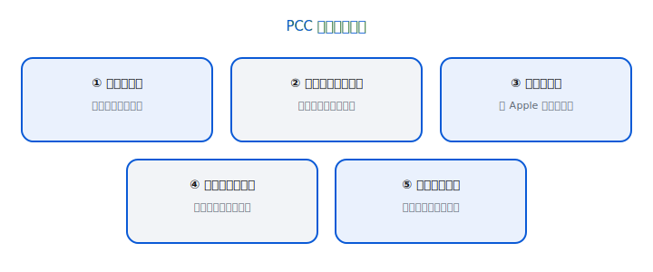
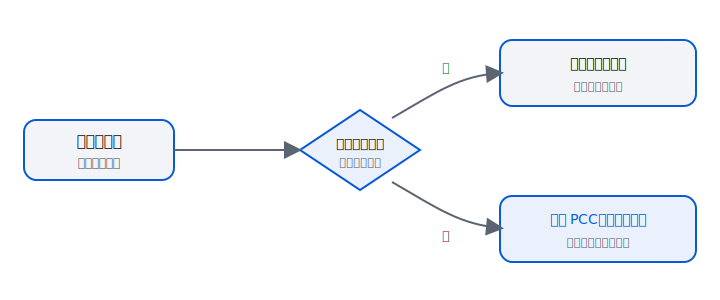
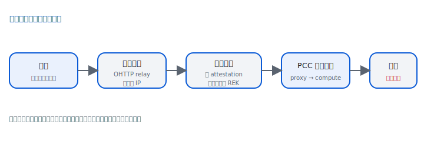

# 你的 AI、你的資料：看懂 Private Cloud Compute（常用 AI 者版）

> 概念版。與開發者版**同一批事實**（`content/knowledge-base.md`），只是更淺的框架。
> 用詞依 GLOSSARY 的 P 政策：技術名詞改白話（認證、人人可查的紀錄、匿名轉送）。
> 事實句附 `[S0X]`；類比不誇大超過事實。

---

## 0. 開場：你每天用 AI，你的資料去哪了？

> [!SUMMARY] 先講結論
>
> 1. 真正聰明的大模型放在雲端，所以你的內容常需要離開手機處理。`[S11]`
> 2. PCC 想給的答案不是「相信我們不看」，而是「**技術上做不到偷看，而且外人可以查證**」。`[S11]`
> 3. 這份說明最後會給你一把**評估任何 AI 服務**的尺——包括它**保護不到的地方**。

你問 AI 助理問題、請它改信、整理照片、看一張圖片——這些內容很多時候會離開你的手機，送到雲端的大型模型處理。`[S11]` 因為真正聰明的大模型太大，塞不進手機，得放在資料中心。

問題來了：**送上去之後，誰看得到？**

大部分雲端服務的答案是「我們保證不亂看」。Apple 的 **Private Cloud Compute（PCC，私有雲端運算）** 想給一個不一樣的答案——不是「相信我們不看」，而是「**技術上做不到偷看，而且外人可以查證**」。`[S11]`

這份說明用三個生活化比喻、一段「請求的旅程」，帶你看它怎麼做到，最後給你一把**可以拿去評估任何 AI 服務**的尺。讀完你會知道：該問哪些問題、什麼算「真的有保護」、以及——很重要——**它保護不到的地方在哪**。

---

## 1. 兩種隱私承諾：口頭 vs 技術

想像兩家餐廳都說「我們不偷吃你打包的菜」：

- **口頭承諾**：門口貼張「員工請勿偷吃」。你只能相信。哪天換了店長、或忙不過來，規矩可能就鬆了；而且你**無從查證**。`[S11]`
- **技術承諾**：打包盒**從你這頭上鎖、鑰匙只有你有**，員工就算想吃也打不開；而且**任何人都能來檢查這個鎖是真的**。`[S11]`

差別在於：第一種靠人的自律，第二種靠物理與數學。PCC 走的是第二種——把「不能看」做進系統設計裡，連營運方自己都繞不過去，而且**外部研究者能查驗**。`[S11]`

> [!NOTE]
>
> 這也是為什麼後面我們一直強調「可不可以查證」——能被外人查證，承諾才有重量。

> [!MISCONCEPTION] 別這樣讀 PCC
>
> - **不是**「資料永遠不上雲」：能在手機做的就留在手機，需要時才上雲（見下面「它怎麼決定要不要上雲」）。`[S11]`
> - **不是**「從此可以無條件相信所有雲端 AI」：PCC 是一套**可被查證**的做法，不是替所有雲端服務背書。`[S05]`
> - **不是**「Apple 公開了所有內部細節」：公開的是**生產實際在跑的軟體**供查驗，不等於每個細節都攤開。`[S05, S07]`
> - **不是**一般雲端代管：重點在**隱私邊界、可驗證性與誠實的界線**，不是把資料放到別人的機房就算數。`[S03]`

---

## 為什麼不能只用「端到端加密」就好？

你可能會想：很多 App 都標榜「端到端加密」，雲端 AI 為什麼不照做？

端到端加密的意思是：只有你和收件人能讀，中間誰都看不到。問題是——**雲端 AI 的工作本身就是「讀懂你的內容再幫你處理」**。要讓一個大模型幫你改寫、摘要、回答，它就**必須能看見**你的輸入。`[S11]` 你沒辦法把資料「端到端加密」給一個非得讀它才能工作的模型。

所以 PCC 換了個目標：不是「連服務方都讀不到」（那樣 AI 就沒法運作），而是——

> [!SUMMARY] PCC 換的目標
>
> **「服務方為了幫你處理而短暫讀到，但技術上無法留存、無法外洩、無法被特定鎖定，而且這一切外人可以查證。」** `[S03]`

這就是為什麼前面那五件事這麼重要：用完即棄、沒有後門、不能被點名、可被查驗——它們合起來，讓「必須讀你的資料」這件事，不再等於「有人能拿你的資料做別的」。`[S03]`

---

## 2. PCC 怎麼運作（五大要求，用類比）

*圖：五件它承諾為你做到的事。`[S03]`*

PCC 有五項核心要求。每項一個類比、一句「**這保護你什麼**」、一句「**怎麼查證**」。`[S03]`

### ① 用完即丟、不留底（無狀態運算）
- **類比**：像一間**用完就自我清空的房間**——你離開後，裡面什麼都不留。
- **這保護你什麼**：你的內容只為了回答你那一次而存在，回覆給你之後就不再留存，連除錯紀錄都不留。`[S03]`
- **怎麼做到的**：每次重開機，系統會把暫存資料的鑰匙整個換掉，舊資料就再也讀不出來。`[S03]`

### ② 技術上做不到，而不只是「保證不做」（可強制執行的保證）
- **類比**：不是貼一張「請勿偷看」的告示，而是**根本沒有開門的鑰匙**。
- **這保護你什麼**：保護來自系統設計本身，不靠人的自律；連負責維運的人也沒有「萬用鑰匙」。`[S03]`

### ③ 沒有人能繞過去讀（無特權存取）
- **類比**：**只有你有鑰匙的盒子**——連管理員、連 Apple 的工程師，在處理當機、半夜搶修時也打不開。`[S03]`
- **這保護你什麼**：沒有「後門」或管理通道能讀你的資料。系統甚至**移掉了**那些平常工程師會用來「進去看看」的工具（像遠端命令列）。`[S06]`

### ④ 沒辦法被「點名」鎖定（不可被指定目標）
- **類比**：你的請求被丟進一個大群體裡處理，**沒人能單獨把「你」挑出來**動手腳。`[S03]`
- **這保護你什麼**：就算有強大的攻擊者想專門針對你，他也得**大動作攻擊一大片系統**才可能碰到你——而那種大動作很容易被發現。`[S03]`
- **怎麼做到的**：每個請求只會交給一小組伺服器；攻陷其中一台，也只碰得到極少數請求，幾乎不可能剛好是「你」的。`[S23]`

### ⑤ 外人可以親自查驗（可驗證透明性）
- **類比**：**人人都能查驗的收據**——Apple 把雲端實際在跑的軟體公開，讓獨立研究者核對。`[S05]`
- **這保護你什麼**：它的宣稱不必你盲信，有人能替你查；而且這份公開紀錄**只能往上加、不能偷偷改**，動了手腳會被看穿。`[S05]`

---

## 3. 它怎麼決定要不要上雲

*圖：簡單自己做，難的才送到私密雲端。`[S11]`*

不是每件事都會上雲。你的手機會先判斷：`[S11]`
- **能在手機上做的** → 就留在手機，根本不出門。
- **比較難、需要大模型的** → 才送到 PCC。

所以「上雲」是**必要時才發生**，不是預設把什麼都送出去。

---

## 4. 你的請求的旅程

*圖：手機 →（匿名轉送）→ 經過認證的雲端伺服器 → 用完即棄。`[S04]`*

當真的需要上雲時，大致是這樣：

1. **先把「你是誰」藏起來**：請求會經過**第三方的中繼站**（目前是 Cloudflare 與 Fastly 兩家），把你的網路位址遮掉，PCC 那頭因此不知道請求是誰送的。`[S04]`
2. **用「不記名通行證」進場**：你的裝置會拿到一種**和你身分對不起來的一次性通行證**，伺服器只能確認「這是合法請求」，但查不出是哪個人、哪支手機。`[S04]`
3. **只交給「通過認證」的伺服器**：你的手機會先要伺服器拿出**密碼學證明**，確認它正在跑的**正是那套公開、可查的軟體**，確認後才把解開請求的鑰匙只交給它。`[S04, S05]`
4. **處理時也彼此加密**：如果一個請求要好幾台伺服器一起算，它們之間也是加密的，而且每台都要先通過同樣的認證。`[S26]`
5. **用完即棄**：處理完、回覆給你之後，資料不留存。`[S03]`

> [!NOTE] 為什麼要這麼麻煩
>
> 因為每一步都在拆掉一個「有人可能偷看」的環節：中繼站拆掉「知道你是誰」、認證拆掉「換成偷改過的軟體」、用完即棄拆掉「事後翻舊帳」。

---

## 5. 為什麼「可驗證」是關鍵差異

一般雲端 AI 多半只能給你「口頭承諾」。PCC 不同：`[S05]`
- Apple 把**每一個上線版本的軟體**公開，記在一個**只能新增、不能偷改**的「**人人可查的紀錄**」裡。`[S05]`
- 你的裝置**只跟「軟體在這份紀錄裡」的伺服器通訊**。`[S05]`
- 紀錄一旦寫入就**不能偷偷移除**，被動手腳會被發現。`[S05]`
- Apple 還提供工具、發獎金（最高一百萬美元），請世界各地的研究者來挑毛病。`[S12]`

這就是「可驗證」的意思：**不是要你相信，而是讓人能查。**

---

## 6. 什麼**不在**保護範圍內（誠實的界線）

沒有任何系統是萬能的。把話說清楚，才知道這把尺能量到哪：

- **不是「Apple 永遠看不到任何東西」**。這些保護是針對**送進 PCC 的那些請求**；而且和所有安全系統一樣，它有自己假設的威脅範圍。`[S07]`
- **「公開原始碼」不等於「每個細節都能對到成品」**。研究者能查「雲端在跑的，跟公開的是不是同一套」；但 Apple **沒有**提供「從公開原始碼重新編出一模一樣的檔案」的能力，所以原始碼比較像是**幫助分析的材料**，不是逐行對照的鐵證。`[S07]`
- **有一點點非個人的資訊還是會露出來**：為了把請求送到附近的機房，中繼站會知道你**大概的地理區域**；請求也會帶一點**不指向個人**的資訊（像是「iPhone」、系統版本）。這些不足以指認你，但誠實起見要講。`[S07]`

> [!BOUNDARY] 為什麼要把界線講清楚
>
> 把這些講清楚，不是潑冷水，而是——一個願意講出自己界線的系統，通常比「保證一切完美」的更值得信。

---

## 7. 把它當一把尺：評估任何 AI 服務

### 7.1 PCC vs 典型雲端 AI（對照表）

> [!NOTE] 怎麼讀這張表
>
> 左欄是典型雲端 AI 常見的做法，右欄是 PCC 的做法；重點在「口頭 vs 技術＋可驗證」的對比，不是逐格背誦。

| 你該問的 | 典型雲端 AI | PCC |
|---|---|---|
| 用完會留底嗎？ | 常會（記錄/除錯） | 用完即棄、不留存 `[S03]` |
| 誰能讀你的資料？ | 服務方/管理員可能可以 | 設計上無人能繞過（含 Apple）`[S03]` |
| 有沒有「萬用管理通道」？ | 常有 | 刻意移除遠端命令列等通道 `[S06]` |
| 能單獨針對你嗎？ | 通常可以 | 很難，需大動作攻擊一大片 `[S23]` |
| 宣稱能被外人查驗嗎？ | 多半不能 | 公開軟體＋可查紀錄可驗 `[S05]` |
| 保護來自？ | 多半是政策承諾 | 技術機制強制 `[S03]` |

### 7.2 AI 隱私評估清單（可拿去問任何服務）
- [ ] 我的輸入**會被留存或拿去訓練**嗎？保留多久？
- [ ] **誰**在什麼情況下能讀到我的內容？有沒有「管理通道」或後門？
- [ ] 它的隱私宣稱**能被獨立第三方查驗**嗎，還是只能我盲信？
- [ ] 保護是**技術上做到**，還是只是**政策上承諾**？
- [ ] 出事時（當機、調查、被駭），保護還在嗎？
- [ ] 它**有沒有誠實講出自己的界線**？（願意講界線的，通常比較可信。）

### 7.3 怎麼用這把尺：一個例子
假設某 AI 服務說「我們很重視你的隱私」。用上面的清單追問：「資料留多久？誰能讀？能不能讓外部研究者查證？」——如果答案都是「相信我們」，那它停在「口頭承諾」；如果能拿出「技術上做不到 + 可被查驗」，它就接近 PCC 這種等級。

---

## 8. 2026：標準在擴大

2026 年，Apple 把 PCC 延伸到自家資料中心**之外**，與 Google、NVIDIA 合作，在 Google Cloud 上運行。`[S13]` 重點對你而言：
- **五大要求完全不變**。`[S13]`
- **Apple 仍完整掌控**這套軟體；你的裝置**只信任經 Apple 簽核**的 PCC 軟體。`[S13]`
- 這**不代表**把你的資料交給 Google 任意處理——信任鏈仍由 Apple 把關。`[S13]`

換句話說：機房可以換地方，**把關的人和規矩沒有變**。

---

## 讀完後你應該帶走什麼

1. **能在手機做的就留在手機**，需要時才上雲——上雲是必要時才發生，不是預設。`[S11]`
2. PCC 把「不能看」做進**系統設計**裡（用完即棄、沒有後門、不能被點名），而且**外人可以查驗**——不是口頭承諾。`[S03, S05]`
3. 它**誠實講出界線**：保證針對 PCC 請求、不宣稱「逐位元組可重現」、會露出大概的地理區域等非個人資訊。願意講界線，通常更值得信。`[S07]`
4. 把這把尺帶走：問任何 AI 服務「留多久？誰能讀？能否被外部查證？是技術還是政策？」`[S03, S05]`

---

## 9. FAQ + 名詞小辭典

**Q：Apple 看得到我的內容嗎？**
針對 PCC 處理的請求，設計上**連 Apple 員工、即使在處理當下也不行**；用完不留存。`[S03]`（精確地說：這是針對 PCC 請求的保證，系統有自己假設的威脅範圍。`[S07]`）

**Q：我要不要做什麼設定？**
不用。能在手機上做的會留在手機，需要上雲時才走 PCC。`[S11]`

**Q：那些「匿名」是真的嗎，還是話術？**
是技術手段：你的位址被第三方中繼遮掉，你用的又是「對不到身分的一次性通行證」，所以伺服器查不出是誰。`[S04]`

**Q：「公開讓人查」是真的有人在查嗎？**
Apple 提供工具與獎金（最高百萬美元）鼓勵研究者找問題。`[S12]`

**Q：當機或被駭的時候呢？**
就算某台伺服器被攻陷，它也只碰得到極少數請求，而且資料用完即棄、每次重開機就清空，攻擊者很難長期賴著。`[S07]`

**Q：聽說 2026 年用到 Google 的機房了，還安全嗎？**
機房換地方，但主導權仍在 Apple，你的手機只信任 Apple 認可的那套，標準沒變。`[S13]`

**名詞小辭典（白話版）**
- **認證（attestation）**：伺服器證明「我跑的是公開的那套軟體」。`[S05]`
- **人人可查的紀錄（透明性日誌）**：公開、只能新增不能偷改的軟體清單。`[S05]`
- **匿名轉送（中繼站）**：藏起你來源位址的轉送層。`[S04]`
- **一次性通行證**：和你身分對不起來、用一次就丟的存取憑證。`[S04]`
- **私有雲端運算（PCC）**：Apple 為私密 AI 推論打造的雲端系統。`[S11]`
