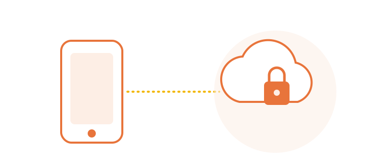
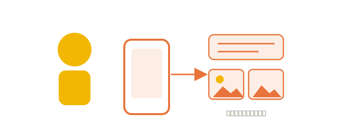
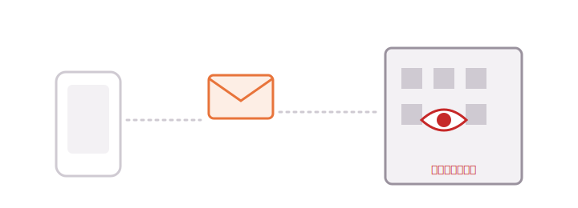
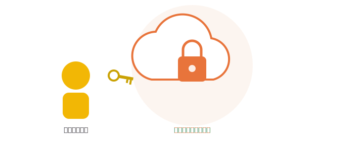
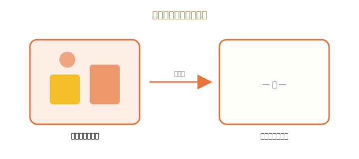
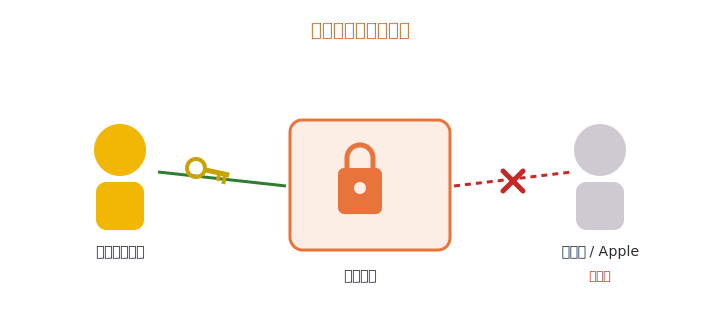
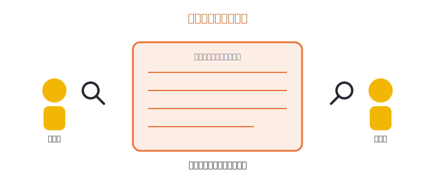
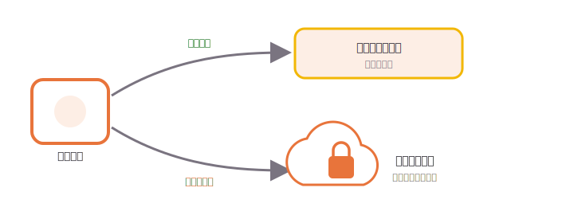
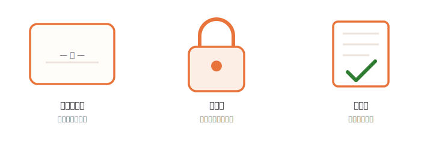

# 聰明的 AI，也能很懂得保護你（普羅大眾版）

> 大圖＋比喻版，正文**零技術名詞**。引用不內嵌；改見文末「依據」頁。
> 與另兩版同一批事實（`content/knowledge-base.md`），最白話的框架。

---

## 0. 封面

# 用得安心的聰明幫手
### 連做這個幫手的人，都看不到你交給它的東西

---

## 1. AI 很聰明，但它需要「看你的東西」

你請手機上的幫手做事——改一段話、整理照片、回答問題。
要幫得上忙，它常常得先**看過你給的內容**。

有些事手機自己就能做完。
但比較難的，得送到網路另一頭、更強大的電腦來幫忙。

---

## 2. 平常，這代表「有人看得到」

東西一旦離開你的手機、送到別人的電腦上，
通常就代表：**那邊的人，有機會看到**。

我們多半只能「相信對方說不會看」。
但我們沒辦法真的去查——對方說了算。

---

## 3. Apple 的點子：連我們自己都看不到

Apple 把這件事反過來做。
它打造了一塊特別的雲端空間，目標是：

> [!SUMMARY] 重點
>
> **不是「我們保證不看」，而是「我們做成連自己都看不到」。**

下面用三個比喻，說明它怎麼辦到。

---

## 4a. 比喻一：用完就自我清空的房間

你的東西被帶進一個**用完就自我清空的房間**。
事情辦完、答案給你之後，
房間就把裡面的一切清空——**什麼都不留下**。

> [!NOTE] 換句話說
>
> 不是「整理乾淨」，而是「像沒人來過」。

---

## 4b. 比喻二：只有你有鑰匙的盒子

你的東西放在一個**只有你有鑰匙的盒子**裡。
就算是管理這套系統的人、
就算遇到故障要進去修，
**他們手上的鑰匙，也打不開這個盒子。**

---

## 4c. 比喻三：人人都能查驗的收據

最特別的一點：你不必只是「相信」。

Apple 把這塊雲端**實際在用的那套東西公開出來**，
就像貼出一張**人人都能查驗的收據**——
而且這面牆上的紀錄**只能往上加、不能偷偷改**，
有人動了手腳，大家都看得出來。

> [!BOUNDARY] 誠實地說
>
> 所以它的承諾，**有人能替你查**，不是空口說白話。
> （能查的是「雲端用的，跟公開的是不是同一套」；不是每個細節都能對到最底層。）

---

## 5. 手機怎麼決定：簡單自己做，難的才送出去

- **簡單的事** → 手機自己做，根本不出門。
- **比較難的事** → 才送到那座「自我清空、上鎖、可查驗」的雲。
- 而且送出去的路上，會**先把你是誰藏起來**。

你不用做任何設定，它自動這樣運作。

---

## 6. 這對你代表什麼

你可以**安心使用聰明的功能**，
而**不必拿你的隱私去交換**。

強大和私密，這次不必二選一。

---

## 7. 常見問題

**問：Apple 看得到我交給它的東西嗎？**
答：針對送到這塊雲端處理的內容，它被設計成**連 Apple 的人都看不到**，用完也不留。

**問：我需要打開什麼設定嗎？**
答：不用。能在手機上做的就留在手機，需要時才自動送到這塊雲。

**問：「公開讓人查」是真的有人查嗎？**
答：是。Apple 提供工具、還發獎金，鼓勵世界各地的研究者來挑毛病。

**問：聽說 2026 年它用到別家的電腦了，還安全嗎？**
答：就算用到別家的機房，**主導權仍在 Apple**，你的手機**只信任 Apple 認可的那套**，保護的標準沒有變。

---

## 8. 一頁總結

# 三句話記住它
1. **用完就清空**——你的東西不留底。
2. **上了鎖**——連做的人都打不開。
3. **可查驗**——它的承諾，有人能替你查。

### 聰明，而且懂得保護你。

---

---

## 依據（provenance）

> 本頁列出每個跨頁/章節背後的官方來源編號（見 `sources/source-index.md`），與 `source-map.md` 一致。正文為求乾淨未內嵌編號。

| 章節 / 比喻 | 來源 |
|---|---|
| 1. AI 需要看你的東西 | S11 |
| 2. 平常代表有人看得到 | S11 |
| 3. 連我們自己都看不到 | S11 |
| 4a. 用完就自我清空的房間（用完即棄） | S03, S11 |
| 4b. 只有你有鑰匙的盒子（沒人能繞過讀取） | S03, S11 |
| 4c. 人人都能查驗的收據（外部可查驗） | S05, S11 |
| 4c. 誠實界線（不能宣稱「全部對到底層」） | S07 |
| 5. 手機怎麼決定 + 先把你是誰藏起來 | S04, S11 |
| 6. 你能安心用 | S03, S05 |
| 7. FAQ（看不到/不留存） | S03 |
| 7. FAQ（鼓勵研究者、發獎金） | S12 |
| 7. FAQ（2026 仍由 Apple 掌控） | S13 |
| 8. 一頁總結 | S03, S05 |
