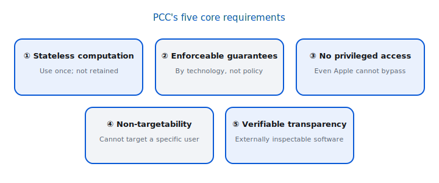
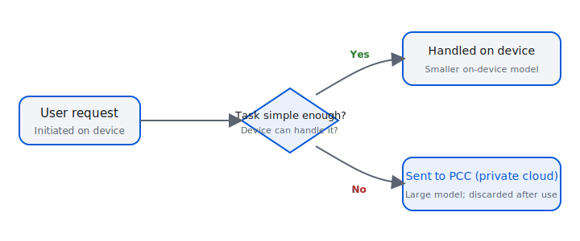
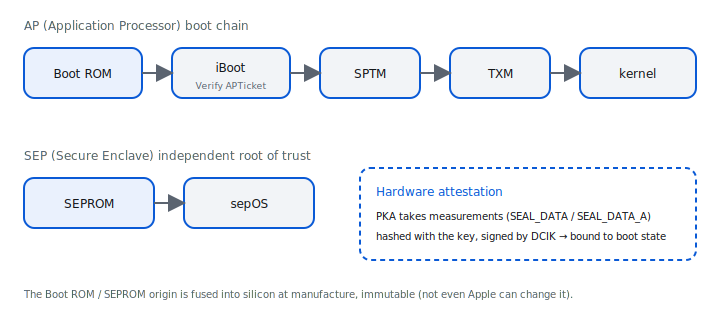
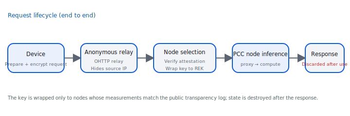
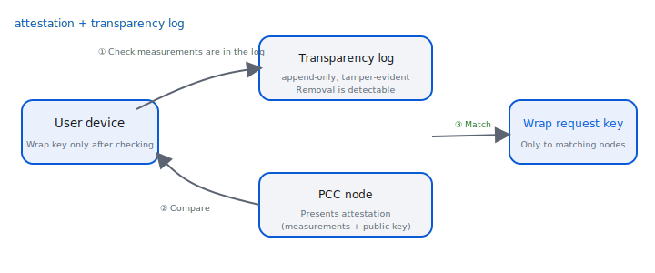
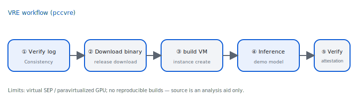
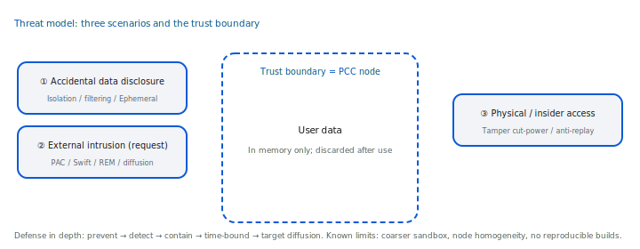
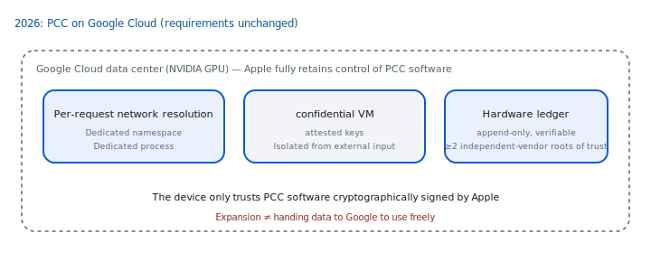

# Private Cloud Compute: verifiable cloud AI privacy (Developer edition)

> Technical reference. All facts are drawn from `content/knowledge-base.md`, cited per sentence with `[S0X]` (sources in `sources/source-index.md`).
> Throughout, it distinguishes "**what Apple claims**" from "**what can be independently verified**". English is a source-aligned translation of the Traditional Chinese source text; technical terms keep their English originals.

---

## 0. Summary and how to read this


*Figure D5: the five core requirements at a glance. `[S03]`*

> [!SUMMARY] The short version
>
> 1. PCC brings "Apple device-grade security and privacy" to the cloud and enforces it through **technical mechanisms** rather than policy promises. `[S11]`
> 2. The core of the verifiable chain is **attestation ↔ transparency log**: a device only sends data to nodes that can cryptographically prove they run published, checkable software — but Apple does **not** provide reproducible builds, so "source ↔ binary" cannot be verified. `[S05, S07]`
> 3. The five requirements are designed never to be violated even under attack; but the guarantees are for PCC requests, and the threat model has its assumed boundaries. `[S03, S07]`

Private Cloud Compute (PCC) is the cloud inference system Apple built for requests in Apple Intelligence that **exceed on-device capability**. Its goal is to bring "Apple device-grade security and privacy" to the cloud and to enforce it through **technical mechanisms** rather than policy promises. `[S11]`

**The five core requirements (one line each):** `[S03]`
1. **Stateless computation**: personal data is used only for the current request and not retained after the response. `[S03]`
2. **Enforceable guarantees**: guarantees come from analyzable technology, not policy. `[S03]`
3. **No privileged runtime access**: no one (including Apple operations) can bypass the protections to read data. `[S03]`
4. **Non-targetability**: a specific user cannot be targeted without disturbing the entire system. `[S03]`
5. **Verifiable transparency**: external researchers can verify the software actually running. `[S03]`

**Reader assumptions**: familiarity with public-key cryptography, TEE / Secure Enclave, attestation, code signing, and threat modeling.

**Chapter map**: §1 motivation →(how) §2 five requirements → §3 root of trust and boot chain → §4 request lifecycle → §5 Attested Request Handling → §6 inference engine and distributed inference → §7 verifiable transparency → §8 hands-on VRE → §9 management and operations → §10 threat model →(what it means) §11 Bounty → §12 2026 expansion → §13 lessons for your systems → §14 appendices.

**How to read**: if you only want the key points, read the "claimed vs verifiable" boxes in §0, §2, §7, §10; if you want to get hands-on, jump straight to §8.

> [!MISCONCEPTION] Common misconceptions (clear these first)
>
> - PCC does **not** mean "Apple can never see anything" — the guarantees are for **requests sent into PCC**, and the threat model has its assumed boundaries. `[S07]`
> - **Open source ≠ reproducible build**: researchers can verify "attestation ↔ transparency log", but **cannot** match source to binary bit-for-bit (§7.4). `[S07]`
> - **The 2026 expansion to Google Cloud ≠ handing data to Google to use freely**: the chain of trust is still anchored in Apple's signing and on-device verification (§12). `[S13]`

---

## 1. Why server AI needs a new model

To do meaningful processing on user requests, cloud AI generally needs **unencrypted access** to personal data, so it cannot directly reuse the end-to-end encryption threat model. `[S11]` The gap in the traditional cloud security model is that privacy claims are **hard to verify and hard to enforce** — a provider claims "we do not log a certain piece of data", researchers usually cannot check, and a single release by the provider may inadvertently start logging it. `[S11]`

PCC's starting point is to bring the advantages of on-device (the user controls the device, hardware and software can be inspected, Apple has no privileged access) into the cloud. `[S11]`


*Figure D1: simpler tasks are handled by the smaller on-device model; only those exceeding its capability are securely offloaded to PCC. `[S11]`*

> [!BOUNDARY] Claimed vs verifiable
>
> This chapter is design motivation (Apple's claim). Whether it is "verifiable" depends on whether the transparency mechanisms in §7/§8 hold.

Compared with traditional cloud: each application server typically holds access credentials to the entire database, so compromising a single server suffices to access any user's data — PCC deliberately rejects this model. `[S03]` Put differently, PCC changes "compromise one = get all data" into "to obtain a specific user's data, you must compromise the entire fleet at scale" (see §5 node selection and §10 target diffusion). 

---

## 2. The five core requirements (in depth)

> The definitions below use the official standard wording. Each section: **definition / mechanism / how enforced / verifiable point**. `[S03]`

### 2.1 Stateless computation of personal data
- **Definition**: PCC uses personal data only to fulfill the current request; personal data is **never** made available to anyone other than the user, **including Apple employees, even while processing is underway**; it must not be retained after the response, nor retained via logging/debugging. `[S03]`
- **Mechanism**: nodes use **Ephemeral Data Mode** — mutable data is written to a dedicated data volume separate from the read-only Signed System Volume; the SEP **randomizes its storage key hierarchy at every boot**, cryptographically guaranteeing that data written in any session cannot be read after a subsequent boot; the `mobile_obliterator` boot task discards the previous encrypted data volume and rebuilds a clean one. `[S16]`
- **How enforced / verifiable point**: the mechanism lives in node software, within the scope covered by the transparency log, which researchers can inspect (see §7/§8). If cross-request caching is ever permitted, statelessness is maintained by encrypting with a device-provided key and erasing PCC's own copy of the key after the request. `[S03]`

### 2.2 Enforceable guarantees
- **Definition**: guarantees are most robust when **fully enforceable by technology**; all components that contribute critically to the overall guarantee must be constrainable and analyzable. `[S03]`
- **Mechanism**: hence the core guarantees do **not** depend on components that are hard to reason about — the official example is that what a TLS-terminating load balancer might do to data during a debug session is extremely hard to reason about; operational needs (server metrics, error logs) must be supported by mechanisms that do not break privacy (see §9). `[S03]`

### 2.3 No privileged runtime access
- **Definition**: there must be no privileged interface that lets Apple Site Reliability Engineering (SRE) staff bypass the privacy guarantees, **even when handling a major incident**; nor any mechanism that **escalates privilege at runtime** (such as loading extra software). `[S03]`
- **Mechanism**: nodes remove/disable dynamic code-execution paths — system shells (such as `zsh`), interpreters (such as JavaScriptCore), debuggers (such as `debugserver`), and JIT. `[S16]` The health/diagnostic data needed for operations is instead obtained through a restricted, auditable dedicated interface (§9). `[S06]`

### 2.4 Non-targetability
- **Definition**: an attacker should not be able to target and compromise a **specific target user's** personal data without launching a broad attack on the **entire system**; this must hold even against someone who can mount a physical supply-chain attack or maliciously enter the data center. `[S03]`
- **Mechanism**: usage limits are imposed with **cryptographically unlinkable tokens** (see §4), and requests are encrypted only to a small node set of size k (see §5). `[S04, S23]`

### 2.5 Verifiable transparency
- **Definition**: researchers must be able to verify, with **high confidence**, that the guarantees match the public commitments, and that **the software actually running in production is the same one they inspected**. `[S03]` Details in §7. `[S05]`

> [!BOUNDARY] Claimed vs verifiable
>
> ①②③④⑤ are all technical claims; among them, "the software actually running = the published software" can be independently verified through the attestation ↔ transparency-log binding (§7). But "source ↔ binary" **cannot** be verified (no reproducible builds, see §7.4). `[S07]`

---

## 3. Root of trust and boot chain


*Figure D2: the hardware root of trust and the boot/code trust chain. `[S14, S16]`*

### 3.1 Apple silicon root of trust
PCC's root of trust is **custom Apple silicon servers**, whose security properties are rooted in silicon and immutable after manufacturing (not even Apple can change them). `[S14]` Three key immutable properties of Apple silicon: `[S14]`
1. **Hardware-level cryptographic identity**: keys are generated at manufacture and fused into silicon, usable only by the Secure Enclave Processor (SEP), hardware-protected and non-exportable. `[S14]`
2. **Secure & Measured Boot**: Secure Boot measures and verifies all executable code; the starting point, the Boot ROM, is placed in silicon at manufacture and is immutable. `[S14]`
3. **Hardware attestation**: the SEP signs software measurements with the hardware identity. `[S14]`

**Secure Enclave (SEP)**: a co-processor on the SoC, containing a true random number generator, a Public-Key Accelerator (PKA), and a dedicated AES engine; at manufacture a **Unique ID (UID)** is fused into silicon, the PKA key is entangled with the UID, and the UID and PKA private key are **never exposed to any software**. `[S14]` PCC adds a **Data Center Identity Key (DCIK)**: generated inside the SEP's PKA from a fixed seed, with the public key recorded into an Apple device database at manufacture. `[S14]`

### 3.2 Boot chain
- **AP side**: Boot ROM → verifies the **Image4** boot manifest (**APTicket**, signed by the Trusted Signing Service) → measures iBoot and locks it into the write-once register **SEAL_DATA_A** → iBoot continues to verify **SPTM (Secure Page Table Monitor)**, **TXM (Trusted Execution Monitor)**, and the Kernel Cache → SPTM starts memory management and initializes TXM → kernel → user space (extending Secure Boot via Code Signing). `[S16]`
- **SEP side**: SEPROM (immutable) → verifies and runs sepOS, locking in **SEAL_DATA**. `[S14, S16]`
- **Hardware attestation**: the PKA hashes the public key to be attested together with the contents of the SEAL_DATA / SEAL_DATA_A registers and signs them with a long-lived key such as the DCIK, binding the key pair to the boot measurements; this all happens in hardware and is immutable. `[S14]`

### 3.3 Software integrity and measurement
- The node OS is a **minimized, hardened subset of iOS**: analyzable, with the entire executable software measurable and described by attestation, and immutable at runtime (changeable only via reboot, which invalidates previously attested keys). `[S16]`
- **Cryptex**: the LLM functionality and application logic are packaged as cryptexes — fully signed and integrity-verified independent software distribution bundles. `[S16]`
- **TXM**: code-execution policy is managed by **TXM, a monitor layer independent of the kernel**, so merely compromising the kernel is not enough to execute arbitrary code; an attacker must also break TXM or the SEP. Policy: all code must be covered by the trust cache, no JIT mappings may be created, Developer Mode may not be enabled, and debugging is unsupported. `[S16]`
- **Software Sealed Registers (SSR)**: similar to a TPM's PCRs, measurements accumulate via a ratchet, can be locked against rollback, and are included in attestation; PCC uses two: the Cryptex Manifest Register and the Configuration Seal Register. `[S16]`
- **SEP–TXM page**: the SEP writes the digest of a newly loaded cryptex to a memory page **writable only by the SEP and shared with TXM**, and TXM only allows code from the trust caches listed there to load — ensuring any new code is included in attestation by the SEP before it runs. `[S16]`
- **Restricted Execution Mode (REM)**: a one-way transition enforced by TXM; after entering it, loading new trust caches is refused; code marked "before" must be terminated before entry, to shrink the attack surface before user data is processed. `[S16]`

> [!BOUNDARY] Claimed vs verifiable
>
> The boot chain and attestation structure are design claims; the "actual boot measurements of a node" can be checked by the device at request time (§5 node validation) and verified by researchers parsing attestation via the VRE (§8).

---

## 4. Request lifecycle (end to end)


*Figure D3: device → relay → node selection → inference → destruction. `[S04]`*

The device is **the root of all security/privacy policy**: when submitting a request, the device first verifies the attestation bundle PCC provides, decides whether to trust it, and **wraps** the request's encryption key **to that node**. `[S04]`

1. **Orchestration**: the on-device `modelmanagerd` decides on-device vs server model; requests destined for PCC are first augmented by `PrivateMLClientInferenceProviderService`, then handed to the `privatecloudcomputed` daemon. `modelmanagerd` assigns a **Session UUID / Session Set UUID** for related requests; these identifiers are **different** from the request identifiers shared with PCC, and their correspondence is **not shared with Apple**. `[S04]`
2. **Anonymous access tokens**: the device obtains a **Token Granting Token (TGT)** from the **PCC Identity Service** (**fully separate** from routing/processing), then exchanges it at the Token Granting Service for a batch of **One-Time Tokens (OTT)**; each request carries one OTT, and PCC uses the OTT public key to verify validity **without learning the user/device identity**. TGT/OTT are built with **RSA Blind Signatures** (RFC 9474; Privacy Pass RFC 9578), making redemption and issuance cryptographically unlinkable. `[S04]`
3. **Fraud-data protocol**: the Token Granting Service makes an anonymous fraud determination via the Fraud Detection Service; up to 8 bits of fraud data are associated to the TGT via blind signatures, and are **not exposed outside the encrypted request**. `[S04]`
4. **Network transport**: the source IP is hidden via a third-party relay, using **Oblivious HTTP (OHTTP, chunked variant)**; the client encrypts to Apple's **Oblivious Gateway** with **HPKE (Hybrid Public Key Encryption)**, and randomly picks an **Oblivious Relay** operated by a different third party (currently **Cloudflare and Fastly**); it authenticates to the OR/OG with Privacy Pass tokens each signed under different keys. `[S04]`
5. **Node selection and key wrapping**: the device verifies each node's attestation, and only wraps the request key to the **REK (node public key)** of nodes whose "attested measurements match a release in the public transparency log" (details in §5). `[S04, S05]`
6. **Processing**: after decryption, the node is handled by the PCC cloud application; initially a **proxy node** takes over and dispatches to one or more **compute nodes** (inference details in §6). `[S04]`
7. **Transitive trust**: nodes verify other nodes' attestation on behalf of the device, and only **re-wrap** the request key to nodes "running a release the device verified to be in the log". `[S05]`
8. **Anti-targeting key transparency**: the OHTTP keys and the TGT/OTT signing keys that PCC announces publicly are all published to the transparency log; clients confirm the keys are logged; researchers can verify "only one set of keys is used during a given period", preventing the use of a dedicated key to target a specific device. `[S04]`

> [!BOUNDARY] Claimed vs verifiable
>
> Token unlinkability (RSA Blind Signatures) and "key wrapping only to nodes in the log" can be verified from the protocol and the log; that the relay does not see content and the Gateway does not see plaintext are also design claims, but the publication of keys in the log makes "whether a dedicated key is used to target you" externally observable.

---

## 5. Attested Request Handling

> This chapter expands steps 5–7 of §4 to the protocol level (read from Attested Request Handling). `[S23]`

### 5.1 CloudBoard on the node
After a node enters REM, the **CloudBoard** family of daemons manages the request lifecycle: `[S23]`
- `cloudboardd`: the central coordinator, accepting network connections from the PCC Gateway and publishing node attestation. Because it faces the network, it **deliberately holds no key that can decrypt a request**, to isolate the attack surface. `[S23]`
- `cb_attestationd`: assembles the attestation bundle with the CloudAttestation framework. `[S23]`
- `cb_jobauthd`: provides the TGT/OTT signing public keys. `[S23]`
- `cb_jobhelper`: **one instance per request**, performing the cryptographic handshake with the device, decrypting the streamed request with the SEP-backed REK, and verifying TGT signatures and OTT derivation. `[S23]`
- `cb_bridged`: takes requests that need to reach outside (such as PIR) over XPC and issues them on their behalf, isolating "the process holding plaintext user data" from the external network. `[S23]`

### 5.2 Keys and channels
At startup `cloudboardd` creates an SEP-protected **REK (Request Encryption Key)** key pair, which the device encrypts to. `[S23]` The device generates a symmetric **DEK (Data Encryption Key)** **per request** to encrypt the payload, and uses **HPKE** to wrap the DEK to the node REK (recipient key = REK, sender key a random ephemeral key per node), forming a bidirectional end-to-end encrypted channel that carries the request, response, and protocol control messages. `[S23]`

**Prefetch**: the device often prefetches attestation from the Gateway via OHTTP during offline periods to save a round trip; to prevent Gateway fingerprinting, each prefetched attestation is **used only once**. `[S23]`

### 5.3 Node validation (CloudAttestation's three checks)
Before the device releases the DEK to a node, CloudAttestation must pass three validations: `[S23]`
1. The node holds a provisioning certificate issued by the **Data Center Attestation CA (DCACA)** → proving it is genuine Apple hardware (standard X.509 validation). `[S23]`
2. **SEP Attestation** shows the system is in the expected secure state (and the attesting DCIK public key matches the provisioning certificate public key). `[S23]`
3. The transparency log **includes** that node's software measurements (Release Inclusion Verification: validating the consistency/inclusion proof in the attestation bundle against the device's local milestone). `[S23]`

The security policy further asserts (excerpt): `SEAL_DATA_A` = SHA2-384 of the AP Image4 ticket; the Cryptex Manifest Register replay matches and is **locked**; the Configuration Seal Register matches; REK key options include OS-bound and sealed-hashes-bound (a state change invalidates the key); anti-replay = SHA-256 of the application metadata; the SoC is production-fused; Ephemeral Data Mode and REM are enabled; Developer mode is off; `config-security-policy=customer`. `[S23]`

### 5.4 Node selection and k
A request is encrypted only to a node subset of size **k**, so a single compromised node can decrypt only a few requests — the quantitative basis of non-targetability. `[S23]` Trade-offs: too small a k means few usable nodes and higher latency; too large weakens target diffusion. Official QoS goal: at 90% average utilization, 99% of requests incur no extra latency. `[S23]`
- just-in-time attestation can drive it down to **k=2**; in scenarios such as cross-data-center failover, prefetch + JIT coexist, giving a **worst case of k=4**. `[S23]`
- The client sets a **hard upper bound** on k (using at most the cap even if the Gateway offers more); the server can **lower, not raise**, k via OHTTP. `[S23]`
- The proxy's outbound selection of compute nodes can use a protocol of "the Gateway gives a candidate set, the proxy picks one cryptographically", avoiding a compromised Gateway unilaterally steering requests to a specific node. `[S23]`
- Routing metadata is reduced in precision by **bucketing + symmetric noise** to prevent fingerprinting. `[S23]`

### 5.5 The timeline of one request (integrating §4–§6)
Putting the pieces together, a typical PCC request goes roughly like this: `[S04, S23, S26]`
1. The device's `modelmanagerd` decides a server model is needed → `privatecloudcomputed` obtains (or has prefetched) anonymous tokens and candidate attestations. `[S04]`
2. The device generates a DEK, encrypts the payload, and sends the request + the DEK (wrapped to candidate nodes) through the OHTTP relay to the PCC Gateway. `[S23]`
3. The Gateway picks a node; the device validates that node's attestation (the three checks in §5.3) and only then releases the HPKE-wrapped DEK to those that pass. `[S23]`
4. The node's `cb_jobhelper` decrypts with the REK, verifies the TGT/OTT, and hands off to `tie-cloud-app` (per request) for tokenization / image decoding. `[S23, S26]`
5. If distributed inference is needed, the proxy re-wraps the DEK to the ensemble via transitive trust; the leader coordinates the two-phase FT/ET, with a KV cache handoff when needed. `[S26]`
6. Tokens stream back to the device (with padding to defend against side channels); the Request Execution Log lets the device check the participating nodes. `[S26, S07]`
7. The request ends: CloudBoard terminates `cb_jobhelper` and the related application processes; data disappears with process reclamation and Ephemeral Data Mode. `[S23, S26]`

> [!NOTE]
>
> Each step corresponds to an externally observable trace (attestation fields, the Request Execution Log, the Apple Intelligence Report) — this is what "verifiable" looks like at the operational level. `[S44]`

---

## 6. Inference engine and distributed inference

> Read from Stateless Inference. Corresponding source code: `CloudBoard`, `AppleCIOMesh`, `AppleComputeEnsembler`, `EnsembleWarden` (all under S08). `[S26, S08]`

### 6.1 The Inference Engine (TIE) and MetalLM
PCC's LLM is driven by Apple's own **TIE (The Inference Engine)** and **MetalLM** (computing with Metal shaders/compute kernels), using **AFM-server (Apple Foundation Model server)**. `[S26]` Mechanisms: the runtime can swap **adapters**, a SentencePiece tokenizer, and an image tokenizer; it can use a draft model for **speculative decoding** and **constrained decoding** (BNF/JSON Schema, TokenGenerationSE); output is streamed and **padded to defend against token-length side channels**. `[S26]`

TIE daemon division of labor: `tie-model-owner` (loads weights via ModelCatalogSE and provides read-only memory references to avoid reloading), `tie-controllerd` (coordination, process reclamation, KV cache, fetching the prompt deny list), `tie-cloud-app` (**per-request** process: deserializes Protobuf, validates parameters, tokenizes, and decodes images with a **memory-safe Swift JPEG decoder**), `tie-inference` (shared, **periodically terminated and restarted** to prevent residual user data). The system uses process pooling to reduce startup cost. `[S26]`

> [!NOTE]
>
> Placing "parsing untrusted input" in the per-request `tie-cloud-app` keeps a single request's compromise from spilling into other requests' data — this lands the statelessness of §2.1 at process granularity. `[S26]`

### 6.2 Distributed inference (ensemble)
To reduce latency / raise throughput, TIE/MetalLM can distribute inference across an **ensemble** of up to **8 nodes**, coordinated by a **leader** that faces the request externally. `[S26]` Nodes are connected into a mesh over USB4 / Ethernet via **AppleCIOMesh** (kext + framework), providing MPI-like primitives (peer-to-peer, gather-to-all, broadcast); the KV cache is exchanged by broadcast-and-gather. `[S26]` Transport is encrypted with **AES-128-GCM** (96-bit anti-replay: 64-bit per-node random + 32-bit counter; reaching 2³² is a catastrophic failure); a decryption failure or broken link is also treated as a catastrophic failure → the whole group reboots and resets. `[S26]`

### 6.3 Ensemble attestation
The device **verifies only the leader**, which transitively vouches for the consistency of the whole group. The leader confirms for each follower: the DCIK certificate is valid, the software measurements match the leader's, the chip/board ID and SoC fusing bits match, the REM/Ephemeral Data Mode/Developer mode states match, and the `config-security-policy` matches. `[S26]` `ensembled` pairs using **Attested TLS** (mutual TLS 1.3, SEP-managed NIST P-384 ECDSA, attestation serialized into an X.509v3 extension); the topology is **at most two chassis, at most four nodes each**, and is fixed for the entire boot session because the secure config is immutable. `[S26]`

### 6.4 Request handoff (KV cache handoff)
LLM output has two phases, **First Token (FT)** and **Extend Token (ET)**; TIE can hand off a request across the ensemble (FT uses a large group to build the KV cache, ET uses a small group to produce tokens one by one). `[S26]` The KV cache is encrypted with a **KVDEK** derived from the DEK; `EnsemblePorter` (`ensembleporterd`/`ensemblefollowerporterd`) and `ensemblewarden` (both **per request**, isolated by entitlement) manage the keys, `ensembled` only sees ciphertext keys (the leader/follower negotiate with ephemeral Curve25519 keys); the cache has a short TTL and is deleted from memory once transfer completes. `[S26]`

> [!BOUNDARY] Claimed vs verifiable
>
> The ensemble topology cap (two chassis / four nodes) is written into the attestation's secure-config, and both the device and researchers can see this chain of certificate fingerprints in the leader's attestation bundle. `[S26]`

### 6.5 Other application types
Beyond TIE, PCC hosts other cloud applications, all within the same trust boundary and request-handling framework: `[S26, S07]`
- **PCC Agent**: runs application-layer workflows on proxy nodes, coordinating remote tool invocations across nodes; the attestation of these Agent Worker nodes also appears in the Request Execution Log, so the device can detect unexpected node participation. `[S07, S26]`
- **Visual Lookup**: privacy-preserving visual entity lookup via embedding search, and it **always sends a PIR query regardless of whether the target data already exists locally**, to prevent a network adversary inferring request characteristics from timing. `[S07]`
- **Private Information Retrieval (PIR)**: uses homomorphic encryption (HE) so the server computes over the encrypted query **without decrypting it**, fetching data from a server outside the trust boundary without revealing which record was fetched; outbound network requests are isolated and issued on its behalf by `cb_bridged`. `[S07, S23]`

---

## 7. Verifiable transparency


*Figure D4: the device first checks that a node's measurements are in the log, then wraps the key. `[S05]`*

### 7.1 Commitment and mechanism
PCC publishes **the software image of every build deployed to production** for research — this is itself an enforceable guarantee: the device only sends data to a node that can cryptographically attest it is running publicly logged software. `[S05]` Four commitments: ① publish all executable code measurements to an **append-only, cryptographically tamper-evident transparency log**; ② publish the log and the corresponding binaries; ③ maintain official research tools; ④ reward via the Bounty. `[S05]`

### 7.2 The 90-day policy and non-removability
Each production image (the OS, applications, all related executables) is published for independent binary inspection **within 90 days of being included in the log, or when the related software update is available, whichever is earlier**. `[S05]` Once a release is signed into the log, **removal is detectable** — analogous to the **log-backed map** structure used by the Key Transparency of iMessage Contact Key Verification. `[S05]`

### 7.3 Key-wrapping binding and transitive trust
The device wraps the request payload key **only to the public key of a node whose "attested measurements match a release in the log"**; these attestations are rooted in the immutable hardware properties of Apple silicon (cryptographic identity, Secure Boot, hardware attestation). `[S05]` Proxy nodes verify other nodes on the device's behalf and only re-wrap the key to releases "the device has verified to be in the log" — transitively extending transparency across the entire processing chain. `[S23]`

### 7.4 What verification can and cannot do (key)
- **Verifiable**: researchers can use the VRE to cross-check the attestation in the Apple Intelligence Report, inspect log consistency, and analyze the public binaries and source code. `[S05, S07]`
- **Cannot**: Apple does **not provide reproducible builds** — the public source **cannot prove** "the released binary was compiled from that source", so the source serves only as **an analysis aid**. `[S07]`

> [!WARNING] Claimed vs verifiable (the most important one)
>
> The verifiable chain is "**attestation ↔ transparency log**", **not** "source ↔ binary". Do not claim reproducible builds in the documentation. `[S07]`

### 7.5 Comparison with other confidential computing
Traditional cloud services usually **do not publish** the complete production image for research; even when they do, they lack a general mechanism for researchers to verify "the published image = what is actually running in production". The official text names existing dedicated mechanisms such as **Intel SGX** and **AWS Nitro attestation**. `[S05]` PCC's difference is binding three things — "**publish every production build + the device only connects to nodes that can attest to public software + an append-only log**" — into a chain that can be **automatically enforced by the end device** and **repeatedly checked by external researchers**, rather than proofs confined to a controlled environment. `[S05]` As a trade-off, PCC still accepts "no reproducible builds" in exchange for a feasible release cadence (§7.4), a known gap relative to the "bit-for-bit reproducible" ideal. `[S07]`

---

## 8. Hands-on verification: the VRE in practice


*Figure D6: the VRE workflow. `[S12]`*

The **VRE (Virtual Research Environment)** is the first research toolset Apple has released for its platform, simulating a PCC node on an Apple silicon Mac and able to boot PCC software that has been minimally modified to allow virtualization. `[S05, S12]`

### 8.1 Environment requirements
Apple silicon Mac, **16GB+ unified memory (24GB+ recommended)**, **macOS Sequoia 15.1 or later**. `[S12, S33]` The CLI is `pccvre`, located at `/System/Library/SecurityResearch/usr/bin`. `[S33]`

### 8.2 A workflow you can follow
```sh
# 1) Enable research VMs in recoveryOS (this opens extra hardware features → expands attack surface)
csrutil allow-research-guests enable          # [S33]

# 2) Back in macOS, review and accept the VRE license (research only, no commercial use)
sudo pccvre license                            # [S33]

# 3) Download the assets of a PCC release
pccvre release download <release-index>        # [S33]

# 4) Create and start an instance
pccvre instance create --name infer --release <release-index>   # [S33]
pccvre instance start  --name infer                              # [S33]

# 5) Issue an inference request to the demo model (prints the attestation bundle,
#    streamed tokens, the Request Execution Log, and a request summary)
pccvre instance inference-request -N infer --prompt "Hello"      # [S34]
```
The demo model's architecture is close to Apple's server-side Foundation model but smaller, language-pretrained only, not instruction-tuned, text-completion only, and as-is (no safety mitigations). `[S33]`

### 8.3 Verifying attestation
```sh
pccvre attestation parse   ...   # shows SEP attestation, the sealed hash ledger, application data, transparency proofs [S34]
pccvre attestation verify  ...   # verifies with the host's CloudAttestation framework [S34]
```
The attestation of a **production node** is taken from the on-device **Apple Intelligence Report** (`--input-format apple-intelligence-report`). `[S34, S44]` Note: a VRE-produced release does **not** correspond to a production release (the SoC identifier / virtual kext / demo model differ), so verifying VRE attestation requires adding `--no-strict-certificate-validation`, `--no-transparency-proof-validation`, and `--no-ensemble-topology-validation`. `[S34, S07]`

### 8.4 Further research capabilities
- Restrict the proxy's transitive trust (specifying allowed compute-node release digests): after modifying the software of the node under test, its attestation digest changes and inference fails — letting you **empirically demonstrate "the log-measurement gate"**. `[S34]`
- Multi-application workloads, ensembles, and FT/ET request handoff (`pccvre workload create` / `ensemble create`) can reproduce the distributed flow of §6. `[S33, S34]`
- Use `rem-dev` to skip the one-way REM switch, attach GDB to debug the kernel, replace SPTM/TXM/kernel-cache firmware, and load a custom cryptex (`pccvre cryptex create`). `[S34]`
- Configure diagnostic forwarding (log/crash/panic/security events/metrics) to a local OpenTelemetry/Splunk HEC collector to inspect what data the node actually emits (echoing §9). `[S34]`

### 8.5 Source code tour
`apple/security-pcc` includes `CloudAttestation` (building/verifying attestation), `Thimble` (the `privatecloudcomputed` daemon), `splunkloggingd` (log filtering), `srd_tools` (VRE tools), `CloudBoard`, `AppleCIOMesh`, `AppleComputeEnsembler`, `CloudMetrics`, `CloudRemoteDiagnostics`, `SecurityMonitorLite`, and more. `[S08, S12]`

> [!WARNING] License notice
>
> This source code is under an "Internal Use License" — 90 days, single machine, for verification only, **redistribution prohibited**. `[S08]`

---

## 9. Management and operations

> Design tension: operations need observability/debugging, but the security model must block all introspection. PCC filters at every data **exit**, with rules published with the image and open to inspection. `[S06]`

- **Deliberately removed/replaced**: interactive shells, sysdiagnose (disabled on entering REM), OS Analytics, execution tracing (such as Instruments Time Profiler). Ephemeral Data Mode ensures that even a reset cannot restart these tools while retaining user data. `[S06]`
- **Metrics**: `CloudMetrics` (swift-metrics backend) → `cloudmetricsd` aggregates locally → exported via OpenTelemetry; there is an **allowlist** of exportable metrics (published with the PrivateCloudSupport cryptex). `[S06]`
- **Log filtering**: `os_log` + `splunkloggingd` filters **per log line** (by an allowlist of "Mach-O sender + format string", matching the un-assembled format string); only pre-approved log lines may leave the node. `[S06]`
- **Crash/panic**: distinguishes intrinsically safe from process-state-dependent; partial/full redaction (registers, unresolvable stack frames, keeping only the last 32 frames); at most 3 partial per node per hour, random 20%. `[S06]`
- **Remote diagnostics**: `CloudRemoteDiagnostics`/`cloudremotediagd`, only to the paired BMC; ping/traceroute, PCAP (**external interface only**), stackshot (once per hour), CPU/memory; all rate-limited to suppress side-channel bandwidth. `[S06]`
- **Security events**: `securitymonitorlited` (EndpointSecurity) captures metadata events for process/file/IOKit/SSH/network etc. and sends them for remote analysis (**only metadata, no introspection of in-process data**). `[S06]`
- **Network firewall**: `denaliSE` does mTLS to the Denali control plane and downloads policies that **allow only the minimum network access required for operations**, enforced at L2/L3/L4. `[S06]`

> [!BOUNDARY] Claimed vs verifiable
>
> The above filtering rules (metrics/log allowlists) are published with the image, researchers can inspect them offline, and in the VRE you can redirect diagnostics to your own collector to observe the actual output (§8.4). `[S06]`

---

## 10. Threat model and attack surface


*Figure D7: the trust boundary and the three threat scenarios. `[S07]`*

PCC's design goal: even under attack, the five requirements are **never violated**; it uses defense in depth. `[S07]` The three scenarios:

### 10.1 Accidental data disclosure
The trust boundary = the PCC node. End-to-end encryption (device↔node, node↔node, with ensemble attestation for distributed inference ensuring keys stay within the group); compute processes are isolated from receive/decrypt processes, exposed to no network, sandboxed; observability data is concentrated at a few exits, filtered + multi-stage review, mutual TLS, with limited retention; traffic-analysis mitigations (token-length attacks; Visual Lookup always runs a PIR query to prevent timing inference); Ephemeral Data Mode. `[S07]`

### 10.2 External intrusion via user requests
- **Prevention**: Pointer Authentication Codes, memory-safe Swift for untrusted input, structured formats such as Protobuf, minimized attack surface. `[S07]`
- **Detection**: a privacy-safe security event monitor (§9). `[S07]`
- **Containment**: REM, process separation, network filtering, SecureConfig static ensembles, the minimized node set that can decrypt a given request (the k of §5), and per-request PIR key isolation in `cb_jobhelper`. `[S07]`
- **Time bounding**: per-request process instances, periodic recycling of long-lived processes (such as `tie-inference`), Ephemeral Data Mode limited to a single boot. `[S07]`
- **Target diffusion**: anonymous tokens, third-party relays, the transparency log, and the Request Execution Log (by which the device can detect unexpected node participation). `[S07]`

### 10.3 Physical or insider access
A single employee, even with authorized internal input, cannot obtain user data; hardware interfaces are treated as untrusted; per-chassis imaging is compared against reference images; **opening the chassis cuts power and erases the chassis attestation anti-replay value**, with daily re-verification and isolation+investigation on anomaly; side-channel testing + anti-replay against replay; no remote management shell. `[S07]` PCC Gateway attack: a non-selected proxy node returns a **NACK** (guaranteeing it does not process, does not call out, and is recorded in the Apple Intelligence Report), and routing bias shows up in the Request Execution Log. `[S07]` Stolen engineer credentials: the hardware identity is generated by the SEP at manufacture in an attested mode, cross-signed by multiple organizations with third-party observation; software is signed with hardware-backed keys at commit + built by Apple's secure build + included in the transparency log. `[S07]`

### 10.4 Known limits (officially stated, present them faithfully)
The sandbox is coarser-grained than WebKit/BlastDoor; node software homogeneity makes a single-point software attack potentially scalable; the relay exposes the approximate geographic region; requests carry non-identifying headers (such as "iPhone", OS build version); no reproducible builds. `[S07]`

---

## 11. Apple Security Bounty (PCC)

Because PCC brings device-grade security to the cloud, the reward categories align with the guide's most critical threats. `[S12]` Official maximum rewards: `[S12]`

| Category | Maximum reward |
|---|---|
| Remote arbitrary code execution with entitlements | **US$1,000,000** |
| Obtaining a user's request data outside the trust boundary | US$250,000 |
| Access to request data from a privileged network position | US$150,000 |
| Ability to execute unattested code | US$100,000 |
| Accidental data disclosure (deployment/config flaw) | US$50,000 |

These rewards align with the **three scenarios** of the threat model: accidental data disclosure, external intrusion via user requests, and physical or insider access (see §10). `[S07, S12]` Even if it does not fit an established category, any security issue with significant impact on PCC **will still be evaluated** for a reward. `[S12]`

---

## 12. The 2026 expansion: PCC on Google Cloud


*Figure D8: dual roots of trust, confidential VMs, a hardware ledger. `[S13]`*

Apple has **for the first time** extended PCC to third-party infrastructure, working with **Google and NVIDIA** to run Apple Intelligence workloads on **Google Cloud** (using **NVIDIA GPUs**); a new generation of Apple Foundation Models draws on "the technology behind the Gemini family of models". `[S13]`

- **The five core requirements are completely unchanged.** `[S13]`
- Architecture: per-request initial network resolution runs in a **dedicated process within a dedicated namespace**; the shared inference software is **recycled short-lived**; **attested keys are placed in a separate dedicated confidential VM isolated from external input**. `[S13]`
- Supply chain: a **cryptographically verifiable append-only ledger** of all Google Cloud hardware is maintained; the **software attestation of sensitive components is rooted in at least two roots of trust from independent vendors**. `[S13]`
- **Key boundary**: **Apple fully retains control of the PCC software; the device only trusts PCC software cryptographically approved by Apple**. All binaries remain publicly inspectable. `[S13]`

> [!WARNING] Accuracy red line
>
> Expanding to Google Cloud **does not mean** handing data to Google to use freely — the chain of trust is still anchored in Apple's signing and on-device verification. `[S13]`

---

## 13. Lessons for your systems

- Treat "**verifiable**" as a design goal: rather than asking users to "trust us not to look", make "cannot look" a technical property that can be externally audited (attestation ↔ transparency log). `[S05]`
- Draw the trust boundary clearly, make all code within it measurable, and **separate the control plane from the data plane** (e.g., `cloudboardd` holds no decryption key; only the support app has the crypto entry) — a borrowable pattern. `[S07, S23]`
- Land statelessness at **process granularity** (per-request processes, periodic recycling) and in the **key lifecycle** (randomized per boot, discarded after use). `[S26]`
- Make operational observability "**exit filtering + published rules**" rather than full introspection. `[S06]`
- Honestly mark "what can and cannot be verified" — as PCC itself states there are no reproducible builds — which builds more trust than over-claiming. `[S07]`

> [!SUMMARY] What to take away
>
> 1. PCC's core is not "trust Apple not to look", but making "cannot look" a **technical property that can be externally audited** (attestation ↔ transparency log). `[S05]`
> 2. Verification has a clear boundary: it can verify "production software running = published software", but **cannot** verify "source = binary" (no reproducible builds) — present this boundary faithfully. `[S07]`
> 3. The five requirements + defense in depth make "compromise one ≠ get all data"; targeting a specific user requires a large-scale attack on the whole fleet and leaves observable traces. `[S03, S07]`

---

## 14. Appendices

### 14.1 Glossary (full version in `docs/GLOSSARY.md`; bilingual map in `docs/BILINGUAL_TERMS.md`)

| Term | One-line definition |
|---|---|
| Private Cloud Compute (PCC) | the cloud system Apple built for private AI inference |
| Stateless computation | use once, discard, retain no personal data |
| Enforceable guarantees | guaranteed by technology, not policy |
| No privileged access | no one (incl. Apple) can bypass protections to read data |
| Non-targetability | a specific user cannot be targeted |
| Verifiable transparency | external parties can inspect the software actually running |
| Attestation | a node proves it runs some known software |
| Transparency log / log-backed map | append-only software record where removal is detectable |
| Secure Enclave (SEP) | the co-processor protecting keys inside the chip |
| Secure Boot | boots only signature-verified OS |
| Trusted Execution Monitor (TXM) | independent of the kernel; only allows trust-cache-covered code |
| Secure Page Table Monitor (SPTM) | starts memory management and initializes TXM in the boot chain |
| Software Sealed Registers (SSR) | TPM-PCR-like, ratchet-accumulated, included in attestation |
| Restricted Execution Mode (REM) | a one-way TXM transition; afterwards refuses new trust caches |
| Ephemeral Data Mode | randomizes the data-volume key at every boot |
| Cryptex | a fully signed, integrity-verified independent software bundle |
| DCIK | Data Center Identity Key, generated in the SEP, used for node attestation |
| REK / DEK / KVDEK | node encryption key / per-request symmetric key / KV cache key |
| TGT / OTT | granting/one-time tokens, built with blind signatures, unlinkable to identity |
| RSA Blind Signatures | make redemption and issuance unlinkable (RFC 9474/9578) |
| OHTTP / Oblivious Relay·Gateway | Oblivious HTTP forwarding that hides the source IP via a third party |
| HPKE | Hybrid Public Key Encryption used to encrypt the request to the node REK |
| TIE / MetalLM / AFM-server | PCC's LLM inference server, Metal framework, and server-side model |
| Ensemble | a distributed-inference unit of up to 8 cooperating nodes |

### 14.2 Full source map (S01–S44)

| ID | Name | ID | Name |
|---|---|---|---|
| S01 | PCC Security Guide (entry) | S23 | Attested Request Handling |
| S02 | Navigating the Guide (TOC) | S24 | Runtime Configuration and Assets |
| S03 | Core Security & Privacy Requirements | S25 | Transitive Trust |
| S04 | Request Flow | S26 | Stateless Inference |
| S05 | Verifiable Transparency | S27 | PCC Agent |
| S06 | Management & Operations | S28 | Visual Lookup |
| S07 | Anticipating Attacks | S29 | Private Information Retrieval |
| S08 | apple/security-pcc (source) | S30 | Release Transparency |
| S09 | Apple Security Bounty | S31 | Source Code (tour) |
| S10 | Bounty Guidelines | S32 | Virtual Research Environment |
| S11 | A new frontier for AI privacy (2024) | S33 | Get Started with the VRE |
| S12 | Security research on PCC (2024/10) | S34 | Interact with the VRE |
| S13 | Expanding PCC (2026) | S35 | Research Variant |
| S14 | Hardware Root of Trust | S36 | Shadow Tunneling |
| S15 | Hardware Integrity | S37 | Reporting Issues |
| S16 | Software Foundations | S38–S43 | Appendices (Secure Boot Tags…Transparency Log) |
| S17 | Software Layering | S44 | Appendix: Apple Intelligence Report |
| S18 | Inspecting Releases | | |
| S19 | Release Notes | | |
| S20 | Stateless Computation & Enforceable Guarantees | | |
| S21 | No Privileged Runtime Access | | |
| S22 | Non-Targetability | | |

Primary citations in this edition: S03/S20–S22/S05 (five requirements), S04/S23 (request flow and handling), S26 (inference), S14/S16 (hardware/software), S05/S07 (transparency and threat model), S06 (operations), S08/S12/S32–S34 (VRE and source), S09/S10/S12 (Bounty), S13/S44 (2026 / Apple Intelligence Report). Full list and URLs in `sources/source-index.md`.

### 14.3 Extended verification checklist
- [ ] Install the VRE and run the §8.2 flow to do inference against the demo model.
- [ ] `pccvre attestation parse/verify` to inspect the attestation structure and the policy fields of §5.3.
- [ ] Take the on-device Apple Intelligence Report and inspect production-node attestation and node distribution. `[S44]`
- [ ] Restrict the proxy's transitive trust, modify node software, and observe the attestation digest change causing inference to fail. `[S34]`
- [ ] Build an ensemble / trigger an FT→ET handoff, and observe the Request Execution Log. `[S34]`
- [ ] Configure diagnostic forwarding and inspect the actual filtered log/metrics output. `[S34]`
- [ ] Read the `CloudAttestation` / `CloudBoard` / `AppleCIOMesh` source (mind the license). `[S08]`

### 14.4 Open item
- On-device model parameter count: the official pages do not publish a precise figure; per the accuracy red line, **third-party numbers are not cited**, and this is kept as `TODO(verify)` (pending Apple's official model documentation). This is the only unresolved item in the whole text.
