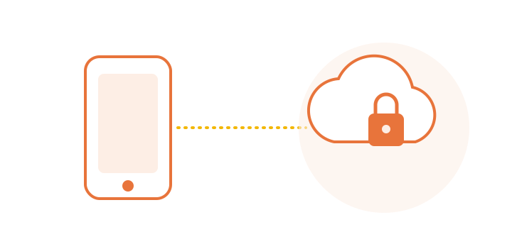
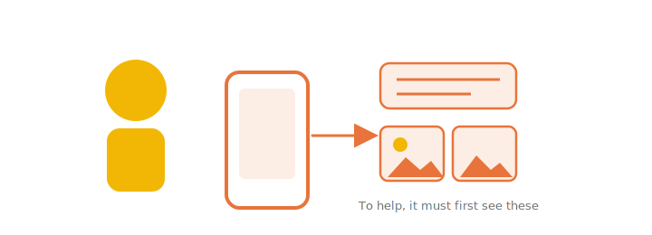
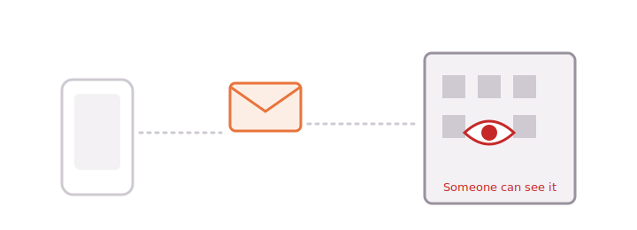
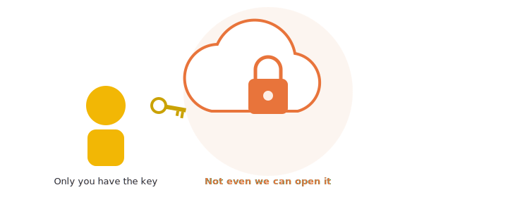
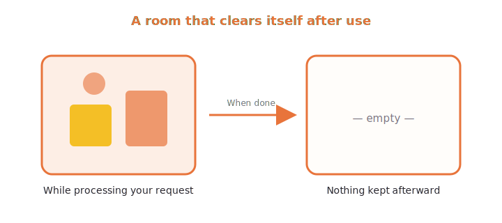
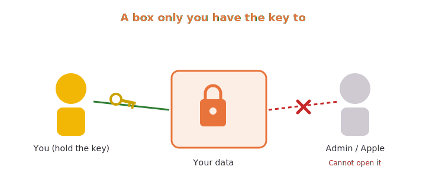
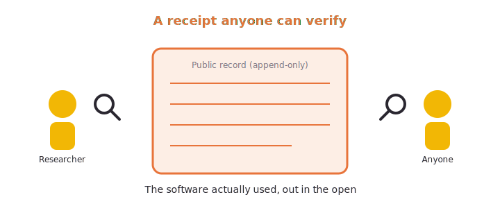
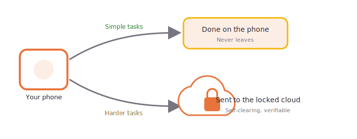
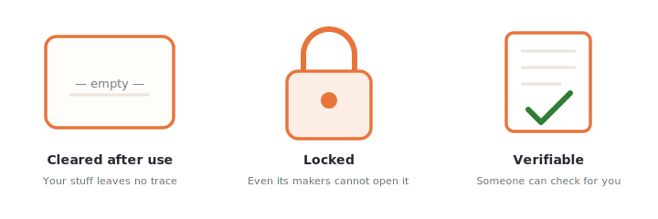

# Smart AI that also knows how to protect you (General edition)

> Large-illustration, analogy-first edition; the body has **no technical jargon**. Source references are not inlined; see the "Sources" page at the end.
> Same set of facts as the other editions (`content/knowledge-base.md`); this is the plainest framing. English is a source-aligned translation of the Traditional Chinese source text.

---

## 0. Cover

# A smart helper you can use with peace of mind
### Even the people who run this helper cannot see what you hand to it

---

## 1. AI is smart, but it needs to "see your stuff"

You ask the helper on your phone to do things — rewrite a sentence, tidy up photos, answer a question.
To be useful, it often has to **look at what you give it** first.

Some things your phone can finish on its own.
But the harder ones have to be sent to a more powerful computer on the other side of the network.

---

## 2. Normally, that means "someone can see it"

Once your stuff leaves your phone and arrives on someone else's computer,
it usually means: **the people over there have a chance to see it**.

Most of the time we can only "trust that they say they won't look".
But we cannot actually check — it is their word.

---

## 3. Apple's idea: not even we can see it

Apple turned this around.
It built a special piece of the cloud with this goal:

> [!SUMMARY] The point
>
> **Not "we promise not to look", but "we built it so that not even we can look".**

The three analogies below explain how it manages that.

---

## 4a. Analogy one: a room that clears itself out after use

Your stuff is taken into a **room that clears itself out after use**.
Once the task is done and the answer is given back to you,
the room wipes everything inside — **nothing is kept**.

> [!NOTE] Put another way
>
> Not "tidied up", but "as if no one had ever been there".

---

## 4b. Analogy two: a box only you have the key to

Your stuff is placed in a **box only you have the key to**.
Even the people who manage this system,
even when something breaks and they need to go in and fix it,
**the keys in their hands cannot open this box.**

---

## 4c. Analogy three: a receipt anyone can verify

The most special part: you do not have to just "trust".

Apple **publishes the very software this part of the cloud actually runs**,
like posting a **receipt anyone can verify** —
and the records on this wall **can only be added to, not quietly changed**,
so if someone tampered with them, everyone could tell.

> [!BOUNDARY] To be honest
>
> So its promise is **something others can check for you**, not just empty words.
> (What can be checked is "whether the cloud is running the same thing that was published"; not every detail can be matched all the way down to the lowest level.)

---

## 5. How the phone decides: do the easy parts itself, send out only the hard ones

- **Easy things** → the phone does them itself and never sends them out.
- **Harder things** → only these go to that "self-clearing, locked, verifiable" cloud.
- And on the way out, it **hides who you are first**.

You do not have to change any setting; it works this way automatically.

---

## 6. What this means for you

You can **use smart features with peace of mind**,
**without trading away your privacy**.

This time, powerful and private are not an either-or.

---

## 7. Common questions

**Q: Can Apple see what I hand to it?**
A: For content sent to this part of the cloud, it is designed so that **not even Apple's people can see it**, and nothing is kept after use.

**Q: Do I need to turn on any setting?**
A: No. What can be done on the phone stays on the phone; only when needed is it sent to this cloud automatically.

**Q: Is "published for anyone to check" actually being checked?**
A: Yes. Apple provides tools and even pays rewards to encourage researchers around the world to look for flaws.

**Q: I heard that in 2026 it started using other companies' computers — is it still safe?**
A: Even when other data centers are used, **Apple stays in control**, and your phone **only trusts the software Apple has approved**, so the protection standard does not change.

---

## 8. One-page summary

# Remember it in three sentences
1. **Clears itself after use** — your stuff leaves no trace.
2. **Locked** — even the people who run it cannot open it.
3. **Verifiable** — its promise is something others can check for you.

### Smart, and it knows how to protect you.

---

---

## Sources (provenance)

> This page lists the official source numbers behind each spread/section (see `sources/source-index.md`), consistent with `source-map.md`. The body omits the numbers for a clean read.

| Section / analogy | Sources |
|---|---|
| 1. AI needs to see your stuff | S11 |
| 2. Normally someone can see it | S11 |
| 3. Not even we can see it | S11 |
| 4a. A room that clears itself out (use-once) | S03, S11 |
| 4b. A box only you have the key to (no bypass access) | S03, S11 |
| 4c. A receipt anyone can verify (externally verifiable) | S05, S11 |
| 4c. Honest boundary (cannot claim "everything matched to the lowest level") | S07 |
| 5. How the phone decides + hides who you are first | S04, S11 |
| 6. You can use it with peace of mind | S03, S05 |
| 7. FAQ (cannot see / not retained) | S03 |
| 7. FAQ (encourages researchers, pays rewards) | S12 |
| 7. FAQ (2026 still controlled by Apple) | S13 |
| 8. One-page summary | S03, S05 |
